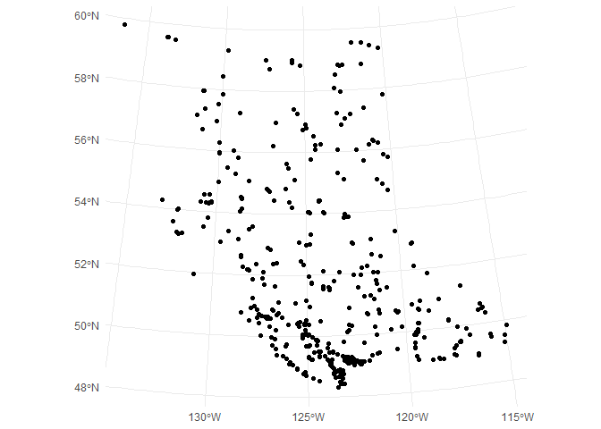
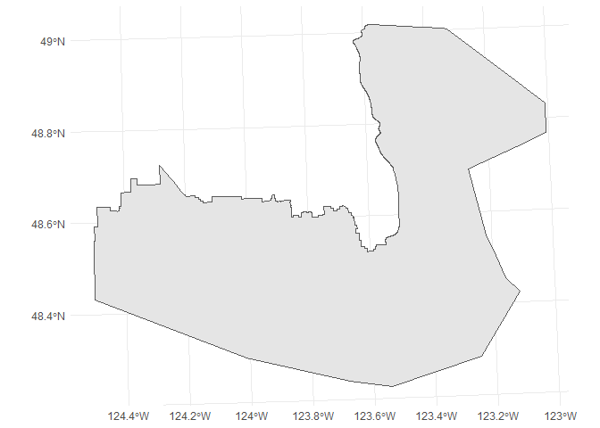

# Introduction

The British Columbia government hosts over 3000 tabular and geospatial data sets in the B.C. Data Catalogue (@bcdc).  Most provincial geospatial data is available through the B.C. Data Catalogue under an open licence, via a [Web Feature Service](https://en.wikipedia.org/wiki/Web_Feature_Service) (WFS). A Web Feature Service is a powerful and flexible service for distributing geographic features over the web, supporting both geospatial and non-spatial querying.  The `bcdata` package for the R programming language (@RCore) wraps two distinct but complimentary web APIs - one for the B.C. Data Catalogue and one for the Web Feature Service.  This allows R users to search, download and import data from the B.C. Data Catalogue, as well as efficiently query and directly read spatial data from the Web Feature Service into their R session. The `bcdata` package implements a novel application of `dbplyr` (@dbplyr) using a Web Feature Service backend, rather than a database backend, where a locally constructed query is processed by a remote server. This allows for fast and efficient spatial data retrieval using familiar `dplyr` syntax. Through this functionality the `bcdata` package connects British Columbia government open data holdings with the vast capabilities of R.

# Usage 

`bcdata` connects to the B.C. Data Catalogue and the Web Feature Service through a few key functions:

- `bcdc_browse()` - Open the catalogue in the default browser
- `bcdc_search()` - Search records in the catalogue
- `bcdc_search_facets()` - List catalogue facet search options
- `bcdc_get_record()` - Print a catalogue record
- `bcdc_tidy_resources()` - Get a data frame of resources for a record
- `bcdc_get_data()` - Get catalogue data
- `bcdc_query_geodata()` - Get & query catalogue geospatial data available through a [Web Feature Service](https://www2.gov.bc.ca/gov/content?id=95D78D544B244F34B89223EF069DF74E)

 *Placeholder for catalogue features demo*

### `bcdc_get_data()`

Once the user has located the B.C. Data Catalogue record with the data they want, `bcdata::bcdc_get_data()` can be used to download and read the data from the record.  Any of the record name, permanent ID or the result from `bcdc_get_record()` can be used to specify the resource. `bcdc_get_data` will automatically detect the type of data being requested and return the appropriate type. Let's try to access data for scholarships in B.C. schools:


```r
bc_scholarships <- bcdc_get_data('bc-schools-district-provincial-scholarships')
```

```
The record you are trying to access appears to have more than one resource.
 Resources: 
1) AwardsScholarshipsHist.xlsx
     format: xlsx 
     url: http://www.bced.gov.bc.ca/reporting/odefiles/AwardsScholarshipsHist.xlsx 
     resource: 4e872f59-0127-4c21-9f41-52d87af9cfab 
     code: bcdc_get_data(record = '651b60c2-6786-488b-aa96-c4897531a884', resource = '4e872f59-0127-4c21-9f41-52d87af9cfab')

2) AwardsScholarshipsHist.txt
     format: txt 
     url: http://www.bced.gov.bc.ca/reporting/odefiles/AwardsScholarshipsHist.txt 
     resource: 8a2cd8d3-003d-4b09-8b63-747365582370 
     code: bcdc_get_data(record = '651b60c2-6786-488b-aa96-c4897531a884', resource = '8a2cd8d3-003d-4b09-8b63-747365582370')

--------
Please choose one option: 

1: AwardsScholarshipsHist.xlsx
2: AwardsScholarshipsHist.txt
```

A catalogue record can have one or multiple data files---or "resources". If there are multiple data resources the user will need to specify which resource they want. bcdata gives the user the option to interactively choose which resource they want, but for scripts it is usually better to be explicit using the `resource` argument to specify the desired dataset. In addition, catalogue records are more reliably referred to by their permanent ID so bcdata also suggests supplying that to the `record` argument instead of the English string. We are interested, in this case, in the `.xlsx` file so we choose option 1 or:


```r
scholars <- bcdc_get_data(record = '651b60c2-6786-488b-aa96-c4897531a884', 
                          resource = '4e872f59-0127-4c21-9f41-52d87af9cfab')
```

The `bcdc_get_data()` function can be used to download geospatial data, including that which is available from the WFS. As a simple demonstration we can download the locations of airports in British Columbia:


```r
bc_airports <- bcdc_get_data(record = 'bc-airports',
                             resource = '4d0377d9-e8a1-429b-824f-0ce8f363512c')

ggplot(bc_airports) +
  geom_sf() +
  theme_minimal()
```

<!-- -->

### `bcdc_query_geodata()`

While `bcdc_get_data()` will retrieve geospatial data, sometimes the geospatial file is very large---and slow to download---and/or the user may only want _some_ of the data. `bcdc_query_geodata()` allows the user to query catalogue geospatial data available from the Web Feature Service using `select` and `filter` functions (just like in [`dplyr`](https://dplyr.tidyverse.org/), @dplyr). The `bcdc::collect()` function returns the `bcdc_query_geodata()` query results as an [`sf` object](https://r-spatial.github.io/sf/) in the R session. The data is only downloaded, and loaded into R as an ‘sf’ object, once the query is complete and the user requests the final result. This is implemented using a custom dbplyr backend---while other `dbplyr` backends interface with various databases (e.g., SQLite, PostgreSQL), the `bcdata` backend interfaces with the BC Web Feature Service.

To demonstrate, we will query the Capital Regional District boundary from the [B.C. Regional Districts geospatial data](https://catalogue.data.gov.bc.ca/dataset/d1aff64e-dbfe-45a6-af97-582b7f6418b9)---the whole file takes 30-60 seconds to download and we only need the one polygon, so the request can be narrowed:


```r
## Find the B.C. Regional Districts catalogue record
bcdc_search("regional districts administrative areas", res_format = "wms", n = 1)
```

```
## List of B.C. Data Catalogue Records
## 
## Number of records: 1
## Titles:
## 1: Regional Districts - Legally Defined Administrative Areas of BC (other, xlsx, wms, kml)
##  ID: d1aff64e-dbfe-45a6-af97-582b7f6418b9
##  Name: regional-districts-legally-defined-administrative-areas-of-bc 
## 
## Access a single record by calling bcdc_get_record(ID)
##       with the ID from the desired record.
```

```r
## Get the metadata for the B.C. Regional Districts catalogue record
bc_rd_record <- bcdc_get_record("d1aff64e-dbfe-45a6-af97-582b7f6418b9")

## Have a quick look at the geospatial columns to help with filter or select
bcdc_describe_feature(bc_rd_record)
```

```
## # A tibble: 21 x 4
##    col_name                 sticky remote_col_type local_col_type
##    <chr>                    <lgl>  <chr>           <chr>         
##  1 id                       FALSE  xsd:string      character     
##  2 LGL_ADMIN_AREA_ID        FALSE  xsd:decimal     numeric       
##  3 ADMIN_AREA_NAME          TRUE   xsd:string      character     
##  4 ADMIN_AREA_ABBREVIATION  TRUE   xsd:string      character     
##  5 ADMIN_AREA_BOUNDARY_TYPE TRUE   xsd:string      character     
##  6 ADMIN_AREA_GROUP_NAME    TRUE   xsd:string      character     
##  7 CHANGE_REQUESTED_ORG     TRUE   xsd:string      character     
##  8 UPDATE_TYPE              TRUE   xsd:string      character     
##  9 WHEN_UPDATED             TRUE   xsd:date        date          
## 10 MAP_STATUS               TRUE   xsd:string      character     
## # ... with 11 more rows
```

```r
## Get the Capital Regional District polygon from the B.C. Regional
## Districts geospatial data
my_regional_district <- bcdc_query_geodata(bc_rd_record) %>%
  filter(ADMIN_AREA_NAME == "Capital Regional District") %>%
  collect()

## Plot the Capital Regional District polygon with ggplot()
ggplot(my_regional_district) +
  geom_sf() +
  theme_minimal()
```

<!-- -->

# Conclusion

Connecting the R programming language with the B.C. Data Catalogue creates an API that allows for the usage of cutting edge statistical and plotting capabilities with a vast collection of open and public data. The enables usages in a modern data science context and provides a pathway to generate insights from public data. 

# Acknowledgements
Author order was determined randomly using the following R code: `set.seed(42); sample(c("Teucher","Hazlitt","Albers"), 3)` because all author contributions are equal.

# References
