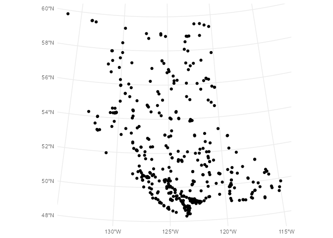
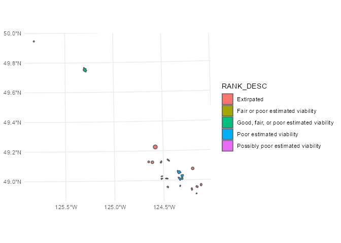

# Statement of Need

`bcdata` is an R package that enables programmatic access, using the R programming language, to data sets housed in the British Columbia (B.C.) Data Catalogue. The package connects the diverse array of mapping, modeling and data processing capabilities of the R ecosystem to the hundreds of open-licensed data sets publicly available in the B.C. Data Catalogue.

# Introduction

The British Columbia government hosts over 2000 tabular and geospatial data sets in the B.C. Data Catalogue (@bcdc).  Most provincial geospatial data is available through the B.C. Data Catalogue under an open licence, via a [Web Feature Service](https://en.wikipedia.org/wiki/Web_Feature_Service). A Web Feature Service---or WFS---is a powerful and flexible service for distributing geographic features over the web, supporting both geospatial and non-spatial querying.  The `bcdata` package for the R programming language (@RCore) wraps two distinct but complimentary web APIs - one for the B.C. Data Catalogue and one for the Web Feature Service.  This allows R users to search, download and import metadata and data from the B.C. Data Catalogue, as well as efficiently query and directly read geospatial data from the Web Feature Service into their R session. The `bcdata` package implements a novel application of `dbplyr` (@dbplyr) using a Web Feature Service backend---rather than a database backend---where a locally constructed query is processed by a remote server. This allows for fast and efficient geospatial data retrieval using familiar `dplyr` syntax. Through this functionality the `bcdata` package connects British Columbia government open data holdings with the vast capabilities of R.

# Related Work

Open data and geospatial data science are currently popular topics in the R community. Packages related to `bcdata` include [`ckanr`](https://docs.ropensci.org/ckanr/) (@ckanr) for interacting with [CKAN](https://ckan.org/) instances, and [`ows4R`](https://github.com/eblondel/ows4R) (@ows4r) which provides a low-level [R6](https://CRAN.R-project.org/package=R6) interface to OWS/WFS servers. `bcdata` seamlessly unifies these operations for B.C. public data holdings, and provides a user-friendly interface using a functional programming style that is familiar to users of the popular `tidyverse` tools. There are many packages available for other jurisdictions' data portals (e.g., [opendatatoronto](https://sharlagelfand.github.io/opendatatoronto/), [opendataes](https://ropenspain.github.io/opendataes/index.html)) however as far as the authors are aware, no other packages provide the `dplyr` like syntax to large geospatial data sets via a WFS.

# Usage 

`bcdata` connects to the B.C. Data Catalogue and the Web Feature Service through a few key functions:

- `bcdc_browse()` - Open the catalogue in the default browser
- `bcdc_search()` - Search records in the catalogue
- `bcdc_search_facets()` - List catalogue facet search options
- `bcdc_get_record()` - Print a catalogue record
- `bcdc_tidy_resources()` - Get a data frame of resources for a catalogue record
- `bcdc_get_data()` - Get catalogue data
- `bcdc_query_geodata()` - Get & query catalogue geospatial data available through a [Web Feature Service](https://www2.gov.bc.ca/gov/content?id=95D78D544B244F34B89223EF069DF74E)


## Search Records & Read Metadata

`bcdc_search()` let's you search records in the B.C. Data Catalogue, returning the search results in your R session. Let's search the catalogue for records that contain the word "scholarships", restricting our search results to only two:


```r
bcdc_search('scholarships', n = 2)
```
```
List of B.C. Data Catalogue Records

Number of records: 2
Titles:
1: BC Schools - District & Provincial Scholarships (xlsx, txt)
 ID: 651b60c2-6786-488b-aa96-c4897531a884
 Name: bc-schools-district-provincial-scholarships
2: BC Arts Council Annual Arts Awards Listing 2009 - 2010 (csv, xls)
 ID: b95fa84f-2328-4adc-aebe-9a214f741fa7
 Name: bc-arts-council-annual-arts-awards-listing-2009-2010 

Access a single record by calling bcdc_get_record(ID)
      with the ID from the desired record.
```

The user can retrieve the metadata for a single catalogue record by using the record name or permanent ID with `bcdc_get_record()`. A catalogue record can have one or multiple data files---or "resources". The user can use the `bcdc_tidy_resources()` function to return a data frame listing all of the data resources and corresponding resource IDs for a catalogue record.


```r
bcdc_tidy_resources("bc-schools-district-provincial-scholarships")
```


```
# A tibble: 2 x 8
  name  id    format bcdata_available url   ext   package_id
  <chr> <chr> <chr>  <lgl>            <chr> <chr> <chr>     
1 Awar… 4e87… xlsx   TRUE             http… xlsx  651b60c2-…
2 Awar… 8a2c… txt    TRUE             http… txt   651b60c2-…
# … with 1 more variable: location <chr>
```


## Get Data

Once the user has located the B.C. Data Catalogue record with the data they want, `bcdata::bcdc_get_data()` can be used to download and read the data from the record.  While any of the record name, permanent ID or the result from `bcdc_get_record()` can be used to specify the data record, `bcdata` suggests supplying the more reliable  permanent ID to the `record` argument to guard against future name changes in an English string. 

Let's try to access data for scholarships in B.C. school record:


```r
scholars <- bcdc_get_data('bc-schools-district-provincial-scholarships')
```

```
The record you are trying to access appears to have more 
 than one resource.
 
 Resources: 
1) AwardsScholarshipsHist.xlsx
    format: xlsx 
    url: 
     http://www.bced.gov.bc.ca/reporting/odefiles/AwardsScholarshipsHist.xlsx 
    resource: 
     4e872f59-0127-4c21-9f41-52d87af9cfab 
    code: 
     bcdc_get_data(record = '651b60c2-6786-488b-aa96-c4897531a884', 
                   resource = '4e872f59-0127-4c21-9f41-52d87af9cfab')

2) AwardsScholarshipsHist.txt
    format: txt 
    url: 
     http://www.bced.gov.bc.ca/reporting/odefiles/AwardsScholarshipsHist.txt 
    resource: 
     8a2cd8d3-003d-4b09-8b63-747365582370 
    code: 
     bcdc_get_data(record = '651b60c2-6786-488b-aa96-c4897531a884', 
                   resource = '8a2cd8d3-003d-4b09-8b63-747365582370')

--------
Please choose one option: 

1: AwardsScholarshipsHist.xlsx
2: AwardsScholarshipsHist.txt
```

Since there are multiple data resources in the record, the user will need to specify which data resource they want. `bcdata` gives the user the option to interactively choose a resource, however for scripts it is usually better to be explicit and specify the desired data resource using the `resource` argument. We are interested, in this case, in the `.xlsx` file so we choose option 1 or:


```r
scholars <- bcdc_get_data(record = '651b60c2-6786-488b-aa96-c4897531a884', 
                          resource = '4e872f59-0127-4c21-9f41-52d87af9cfab')
head(scholars)
```


```
# A tibble: 6 x 9
  SCHOOL_YEAR_ISSU… `Sub Pop Code` `Num Prov Schola… `Num Prov Schola…
  <chr>             <chr>          <chr>             <chr>            
1 1996/1997         ALL STUDENTS   3509              20               
2 1996/1997         FEMALE         1921              7                
3 1996/1997         MALE           1588              13               
4 1997/1998         ALL STUDENTS   3748              20               
5 1997/1998         FEMALE         2094              11               
6 1997/1998         MALE           1654              9                
# … with 5 more variables: Num District Scholarships <chr>,
#   Data Level <chr>, Public Or Independent <chr>,
#   District Number <chr>, District Name <chr>
```

The `bcdc_get_data()` function can be used to download geospatial data, including that which is available from the Web Feature Service. As a simple demonstration we can download the locations of airports in British Columbia:


```r
bc_airports <- bcdc_get_data(record = 'bc-airports',
                             resource = '4d0377d9-e8a1-429b-824f-0ce8f363512c')

ggplot(bc_airports) +
  geom_sf()
```

<!-- -->

## Query & Read Geospatial Data

While `bcdc_get_data()` will retrieve geospatial data, sometimes the geospatial file is very large---and slow to download---or the user may only want _some_ of the data. `bcdc_query_geodata()` allows the user to query catalogue geospatial data available from the Web Feature Service using `select` and `filter` functions (just like in [`dplyr`](https://dplyr.tidyverse.org/), @dplyr). The `bcdc::collect()` function returns the `bcdc_query_geodata()` query results as an [`sf` object](https://r-spatial.github.io/sf/) in the R session. The query is processed on the server, filtering the data to only those records and fields the user has specified. Once the query is complete and the user requests the final result, then only the filtered data is downloaded and loaded into R as an ‘sf’ object, substantially reducing the size of the data being downloaded. This functionality is implemented using a custom `dbplyr` backend---while other `dbplyr` backends interface with various databases (e.g., SQLite, PostgreSQL), the `bcdata` backend interfaces with the B.C. Data Catalogue Web Feature Service.

To demonstrate, we will query the Vancouver Island Marmot location polygons from the publicly-available [Species and Ecosystems at Risk Occurrences geospatial data](https://catalogue.data.gov.bc.ca/dataset/0e035e55-f257-458f-9a96-80c01c69d389)---the whole file takes over 100 seconds to download and we only need the marmot polygons, so the request can be narrowed:


```r
## Get the metadata for the Species and Ecosystems at Risk Occurrences catalogue record
sp_eco_record <- bcdc_get_record("0e035e55-f257-458f-9a96-80c01c69d389")

## Have a quick look at the geospatial columns to help with filter or select
bcdc_describe_feature(sp_eco_record)
```

```
# A tibble: 59 x 5
   col_name   sticky remote_col_type local_col_type column_comments             
   <chr>      <lgl>  <chr>           <chr>          <chr>                       
 1 id         FALSE  xsd:string      character       <NA>                       
 2 OCCR_AREA… FALSE  xsd:decimal     numeric        "Primary unique numeric ide…
 3 FEATURE_C… TRUE   xsd:string      character      "A standard numeric code to…
 4 SHAPE_ID   FALSE  xsd:decimal     numeric        "Shape ID is the unique ide…
 5 OCCR_ID    FALSE  xsd:decimal     numeric        "Occurrence ID is the Eleme…
 6 SCI_NAME_F TRUE   xsd:string      character      "Scientific Name Formatted …
 7 SCI_NAME   FALSE  xsd:string      character      "Scientific Name in the sci…
 8 ENG_NAME_F TRUE   xsd:string      character      "English Name formatted is …
 9 ENG_NAME   TRUE   xsd:string      character      "English Name is the Common…
10 EL_TYPE    FALSE  xsd:string      character      "Element Type identifies th…
# … with 49 more rows
```

```r
## Naively download the whole data object, then filter it for the 
## occurrences of Vancouver Island Marmot (Marmota vancouverensis)
system.time(
  all_sp_eco <- bcdc_get_data(sp_eco_record, resource = "f851316c-f065-47b1-a982-bcbc347164e8")
)
```

```
   user  system elapsed 
 30.975   9.317 188.187 
```

```r
format(object.size(all_sp_eco), units = "Mb")
```

```
[1] "104.2 Mb"
```

```r
marmots <- filter(all_sp_eco, SCI_NAME == "Marmota vancouverensis") %>% 
  arrange(OCCR_ID)

## Get only the occurrences of Vancouver Island Marmot (Marmota vancouverensis), 
## using filter() before collect() to perform the filtering on the server.
system.time({
  marmots2 <- bcdc_query_geodata(sp_eco_record) %>%
    filter(SCI_NAME == "Marmota vancouverensis") %>%
    collect() %>% 
    arrange(OCCR_ID)
})
```

```
   user  system elapsed 
  0.267   0.013   1.801 
```

```r
format(object.size(marmots2), units = "Mb")
```

```
[1] "0.1 Mb"
```

```r
# Check the two final objects are the same 
all.equal(st_geometry(marmots), st_geometry(marmots2))
```

```
[1] TRUE
```

```r
## Plot the Marmot occurrences with ggplot()
ggplot(marmots2) +
  geom_sf(aes(fill = RANK_DESC))
```

<!-- -->

This demonstrates the efficiency of the filter-first then download approach: The size of the object downloaded by using `bcdc_query_geodata()` with `filter()` is 100% smaller than downloading the entire data set using `bcdcd_get_data()` and filtering locally.

# Conclusion

The `bcdata` R package connects R users with British Columbia government's vast collection of data holdings in the B.C. Data Catalogue through an efficient and familiar interface. This enables the use of cutting edge statistical and plotting capabilities in a modern data science context, and provides a pathway to generate important insights from open and public data.

# Acknowledgements
Author order was determined randomly using the following R code: `set.seed(42); sample(c("Teucher","Hazlitt","Albers"), 3)` because all author contributions are equal.

# References
