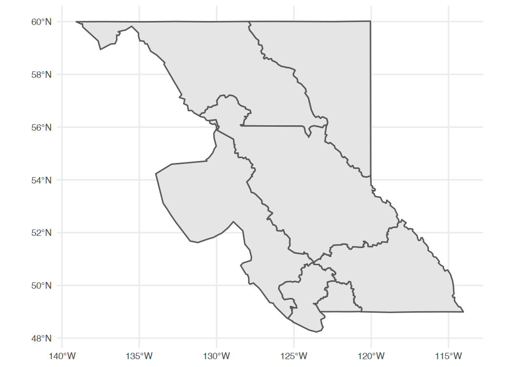

<!--
Copyright 2019 Province of British Columbia

Licensed under the Apache License, Version 2.0 (the "License");
you may not use this file except in compliance with the License.
You may obtain a copy of the License at

http://www.apache.org/licenses/LICENSE-2.0

Unless required by applicable law or agreed to in writing, software distributed under the License is distributed on an "AS IS" BASIS,
WITHOUT WARRANTIES OR CONDITIONS OF ANY KIND, either express or implied.
See the License for the specific language governing permissions and limitations under the License.
-->


The `bcdata` [R](https://www.r-project.org/) package contains functions for searching & retrieving data from the [B.C. Data Catalogue]( https://catalogue.data.gov.bc.ca).

The [B.C. Data Catalogue](https://www2.gov.bc.ca/gov/content?id=79B5224167334667A44C9E8B5143D0C5) is the place to find British Columbia Government data, applications and web services. Much of the data are released under the [Open Government Licence --- British Columbia](https://www2.gov.bc.ca/gov/content/data/open-data/open-government-licence-bc), as well as numerous other [licences](https://catalogue.data.gov.bc.ca/dataset?download_audience=Public).


You can install `bcdata` directly from GitHub using the [remotes](https://cran.r-project.org/package=remotes) package:


```r
install.packages("remotes")

remotes::install_github("bcgov/bcdata")
library(bcdata)
```

### `bcdc_browse()`

`bcdata::bcdc_browse()` let's you access the [B.C. Data Catalogue web interface](https://catalogue.data.gov.bc.ca) directly from R---opening the home page in your default browser:


```r
## Take me to the B.C. Data Catalogue home page
bcdc_browse()
```

If you know the catalogue record "human-readable" name or permanent ID you can open directly to the record web page:


```r
## Take me to the B.C. Winery Locations catalogue record using the record name
bcdc_browse("bc-winery-locations")

## Take me to the B.C. Winery Locations catalogue record using the record ID
bcdc_browse("1d21922b-ec4f-42e5-8f6b-bf320a286157")
```

You can also use `bcdc_browse()` to open to search results in the catalogue:


```r
## Take me to the catalogue search results for 'wineries'
bcdc_browse("wineries")
```

### `bcdc_search()`

`bcdata::bcdc_search()` let's you search records in the B.C. Data Catalogue, returning the search results in your R session.

Let's search the catalogue for records that contain the word "recycling":


```r
## Give me the catalogue search results for 'recycling'
bcdc_search("recycling")
#> List of B.C. Data Catalogue Records
#> 
#> Number of records: 6
#> Titles:
#> 1: BC FIRST Tire Recycling Data 1991-2006 (csv)
#>  ID: a29ad492-29a2-44b9-8693-d27a8cc8e686
#>  Name: bc-first-tire-recycling-data-1991-2006
#> 2: Tire Stewardship BC Tire Recycling Data (csv)
#>  ID: f791329b-c2dc-4f82-9993-209780f2a1c6
#>  Name: tire-stewardship-bc-tire-recycling-data
#> 3: Environmental Protection Information Resources e-Library ()
#>  ID: dae0f2c3-b4f4-4d16-a96d-d7fe7c1581f3
#>  Name: environmental-protection-information-resources-e-library
#> 4: PICES Tsunami Debris Aerial Photo Survey Map ()
#>  ID: 7e74680e-5851-4fc2-b0fa-5e18198b8fa6
#>  Name: pices-tsunami-debris-aerial-photo-survey-map
#> 5: Cross-linked Information Resources (CLIR) (other)
#>  ID: 6f8576bc-1585-429c-97f9-e94b059fa455
#>  Name: cross-linked-information-resources-clir
#> 6: Ministry of Transportation (MOT) Surface Type (other, wms, kml)
#>  ID: 3a77f19f-2f49-416c-ad32-75e8d06e6c5a
#>  Name: ministry-of-transportation-mot-surface-type 
#> 
#> Access a single record by calling bcdc_get_record(ID)
#>       with the ID from the desired record.
```

You can set the number of records to be returned from the search and/or you can customize your search using the catalogue search _facets_ `license_id`, `download_audience`, `type`, `res_format`, `sector`, and `organization`:


```r
## Give me the first catalogue search result for 'recycling'
bcdc_search("recycling", n = 1)
#> List of B.C. Data Catalogue Records
#> 
#> Number of records: 1
#> Titles:
#> 1: BC FIRST Tire Recycling Data 1991-2006 (csv)
#>  ID: a29ad492-29a2-44b9-8693-d27a8cc8e686
#>  Name: bc-first-tire-recycling-data-1991-2006 
#> 
#> Access a single record by calling bcdc_get_record(ID)
#>       with the ID from the desired record.

## Give me the catalogue search results for 'recycling' where the
## data is tabular and licenced under Open Government Licence – British Columbia
bcdc_search("recycling", type = "Dataset", license_id = "2")
#> List of B.C. Data Catalogue Records
#> 
#> Number of records: 1
#> Titles:
#> 1: BC FIRST Tire Recycling Data 1991-2006 (csv)
#>  ID: a29ad492-29a2-44b9-8693-d27a8cc8e686
#>  Name: bc-first-tire-recycling-data-1991-2006 
#> 
#> Access a single record by calling bcdc_get_record(ID)
#>       with the ID from the desired record.
```

You can see all valid values for the catalogue search facets using `bcdata::bcdc_search_facets()`:


```r
## Valid values for search facet 'license_id'
bcdc_search_facets(facet = "license_id")
#>         facet count                                             display_name name
#> 1  license_id    47                                        Statistics Canada   21
#> 2  license_id     1               Queen's Printer Licence - British Columbia   25
#> 3  license_id    11 Open Government Licence – Municipality of North Cowichan   44
#> 4  license_id    15                     Open Government Licence - WorkSafeBC   41
#> 5  license_id     4                 Open Government Licence - Destination BC   43
#> 6  license_id    58                         Open Government Licence - Canada   24
#> 7  license_id  1533               Open Government Licence - British Columbia    2
#> 8  license_id     3                  Open Government Licence - BC Assessment   47
#> 9  license_id     2 Open Data Commons - Public Domain Dedication and Licence   45
#> 10 license_id    16                           Elections BC Open Data Licence   42
#> 11 license_id  1249                                              Access Only   22
```

Finally, you can retrieve the _metadata_ for a single catalogue record by using the record name or ID with `bcdc_get_record()`. It is advised to use the permanent ID rather than the human-readable name in non-interactive situations---like scripts---to guard against future name changes of a record:


```r
## Give me the catalogue record metadata for `bc-first-tire-recycling-data-1991-2006`
bcdc_get_record("a29ad492-29a2-44b9-8693-d27a8cc8e686")
#> B.C. Data Catalogue Record: BC FIRST Tire Recycling Data 1991-2006 
#> 
#> Name: bc-first-tire-recycling-data-1991-2006 (ID: a29ad492-29a2-44b9-8693-d27a8cc8e686 )
#> Permalink: https://catalogue.data.gov.bc.ca/dataset/a29ad492-29a2-44b9-8693-d27a8cc8e686
#> Sector: Natural Resources
#> Licence: Open Government Licence - British Columbia
#> Type: Dataset
#> Last Updated: 2018-07-12 
#> 
#> Description: Financial Incentives for Recycling Scrap Tires (FIRST) collection and recycling data
#> (tonnes) from 1991 to 2006. In 2007 [Tire Stewardship BC](http://www.tsbc.ca/), a
#> not for profit society, launched the new scrap tire recycling program replacing the
#> government-run program that had been in place since 1991. Tire Stewardship BC
#> collection and recycling data is available
#> [here](https://catalogue.data.gov.bc.ca/dataset/f791329b-c2dc-4f82-9993-209780f2a1c6). 
#> 
#> Resources: ( 1 )
#> # A tibble: 1 x 8
#>   name                 url                                                                          id                 format ext   package_id            location     bcdata_available
#>   <chr>                <chr>                                                                        <chr>              <chr>  <chr> <chr>                 <chr>        <lgl>           
#> 1 BC FIRST Tire Recyc… https://catalogue.data.gov.bc.ca/dataset/a29ad492-29a2-44b9-8693-d27a8cc8e6… ed24cca3-d8cb-4f5… csv    csv   a29ad492-29a2-44b9-8… catalogueda… TRUE
```


### `bcdc_get_data()`

One you have located the B.C. Data Catalogue record with the data you want, you can use `bcdata::bcdc_get_data()` to download and read the data from the record.  You can use the record name, ID or the result from `bcdc_get_record()`. Let's look at the B.C. Highway Web Cameras data:


```r
## Get the data resource for the `bc-highway-cams` catalogue record
bcdc_get_data("bc-highway-cams")
#> # A tibble: 880 x 19
#>    links_bchighway… links_imageDisp… links_imageThum… links_replayThe…    id highway_number highway_locatio… camName caption credit orientation latitude longitude imageStats_upda…
#>    <chr>            <chr>            <chr>            <chr>            <dbl> <chr>          <chr>            <chr>   <chr>   <chr>  <chr>          <dbl>     <dbl> <chr>           
#>  1 http://images.d… http://images.d… http://images.d… http://images.d…     2 5              Coquihalla       Coquih… Hwy 5,… <NA>   N               49.6     -121. 2019-11-26 12:33
#>  2 http://images.d… http://images.d… http://images.d… http://images.d…     5 3              <NA>             Kooten… Hwy 3,… <NA>   E               49.1     -117. 2019-11-26 12:33
#>  3 http://images.d… http://images.d… http://images.d… http://images.d…     6 16             <NA>             Smithe… Hwy 16… <NA>   N               54.8     -127. 2019-11-26 12:27
#>  4 http://images.d… http://images.d… http://images.d… http://images.d…     7 1              Fraser Valley    Cole R… Hwy 1 … <NA>   E               49.1     -122. 2019-11-26 12:25
#>  5 http://images.d… http://images.d… http://images.d… http://images.d…     8 1              Vancouver Island Malaha… Hwy 1 … <NA>   N               48.6     -124. 2019-11-26 12:30
#>  6 http://images.d… http://images.d… http://images.d… http://images.d…     9 19             <NA>             Nanaim… Hwy 19… <NA>   N               49.2     -124. 2019-11-26 12:21
#>  7 http://images.d… http://images.d… http://images.d… http://images.d…    10 97             Northern Region  South … Hwy 97… <NA>   N               56.1     -121. 2019-11-26 12:21
#>  8 http://images.d… http://images.d… http://images.d… http://images.d…    11 1              Trans Canada Hi… Revels… Hwy 1 … <NA>   NE              51.0     -118. 2019-11-26 12:34
#>  9 http://images.d… http://images.d… http://images.d… http://images.d…    12 1              Trans Canada Hi… Three … Hwy 1,… <NA>   E               50.9     -118. 2019-10-25 16:34
#> 10 http://images.d… http://images.d… http://images.d… http://images.d…    13 99             Peace Arch Bord… Peace … Hwy 99… "For … N               49.0     -123. 2019-11-26 12:34
#> # … with 870 more rows, and 5 more variables: imageStats_updatePeriodStdDev <dbl>, markedDelayed <dbl>, updatePeriodMean <dbl>, updatePeriodStdDev <dbl>, fetchMean <dbl>

## OR use the permanent ID, which is better for scripts or non-interactive use
bcdc_get_data("6b39a910-6c77-476f-ac96-7b4f18849b1c")
#> # A tibble: 880 x 19
#>    links_bchighway… links_imageDisp… links_imageThum… links_replayThe…    id highway_number highway_locatio… camName caption credit orientation latitude longitude imageStats_upda…
#>    <chr>            <chr>            <chr>            <chr>            <dbl> <chr>          <chr>            <chr>   <chr>   <chr>  <chr>          <dbl>     <dbl> <chr>           
#>  1 http://images.d… http://images.d… http://images.d… http://images.d…     2 5              Coquihalla       Coquih… Hwy 5,… <NA>   N               49.6     -121. 2019-11-26 12:33
#>  2 http://images.d… http://images.d… http://images.d… http://images.d…     5 3              <NA>             Kooten… Hwy 3,… <NA>   E               49.1     -117. 2019-11-26 12:33
#>  3 http://images.d… http://images.d… http://images.d… http://images.d…     6 16             <NA>             Smithe… Hwy 16… <NA>   N               54.8     -127. 2019-11-26 12:27
#>  4 http://images.d… http://images.d… http://images.d… http://images.d…     7 1              Fraser Valley    Cole R… Hwy 1 … <NA>   E               49.1     -122. 2019-11-26 12:25
#>  5 http://images.d… http://images.d… http://images.d… http://images.d…     8 1              Vancouver Island Malaha… Hwy 1 … <NA>   N               48.6     -124. 2019-11-26 12:30
#>  6 http://images.d… http://images.d… http://images.d… http://images.d…     9 19             <NA>             Nanaim… Hwy 19… <NA>   N               49.2     -124. 2019-11-26 12:21
#>  7 http://images.d… http://images.d… http://images.d… http://images.d…    10 97             Northern Region  South … Hwy 97… <NA>   N               56.1     -121. 2019-11-26 12:21
#>  8 http://images.d… http://images.d… http://images.d… http://images.d…    11 1              Trans Canada Hi… Revels… Hwy 1 … <NA>   NE              51.0     -118. 2019-11-26 12:34
#>  9 http://images.d… http://images.d… http://images.d… http://images.d…    12 1              Trans Canada Hi… Three … Hwy 1,… <NA>   E               50.9     -118. 2019-10-25 16:34
#> 10 http://images.d… http://images.d… http://images.d… http://images.d…    13 99             Peace Arch Bord… Peace … Hwy 99… "For … N               49.0     -123. 2019-11-26 12:34
#> # … with 870 more rows, and 5 more variables: imageStats_updatePeriodStdDev <dbl>, markedDelayed <dbl>, updatePeriodMean <dbl>, updatePeriodStdDev <dbl>, fetchMean <dbl>

## OR use the result from bcdc_get_record()
my_data <- bcdc_get_record("6b39a910-6c77-476f-ac96-7b4f18849b1c")
bcdc_get_data(my_data)
#> # A tibble: 880 x 19
#>    links_bchighway… links_imageDisp… links_imageThum… links_replayThe…    id highway_number highway_locatio… camName caption credit orientation latitude longitude imageStats_upda…
#>    <chr>            <chr>            <chr>            <chr>            <dbl> <chr>          <chr>            <chr>   <chr>   <chr>  <chr>          <dbl>     <dbl> <chr>           
#>  1 http://images.d… http://images.d… http://images.d… http://images.d…     2 5              Coquihalla       Coquih… Hwy 5,… <NA>   N               49.6     -121. 2019-11-26 12:33
#>  2 http://images.d… http://images.d… http://images.d… http://images.d…     5 3              <NA>             Kooten… Hwy 3,… <NA>   E               49.1     -117. 2019-11-26 12:33
#>  3 http://images.d… http://images.d… http://images.d… http://images.d…     6 16             <NA>             Smithe… Hwy 16… <NA>   N               54.8     -127. 2019-11-26 12:27
#>  4 http://images.d… http://images.d… http://images.d… http://images.d…     7 1              Fraser Valley    Cole R… Hwy 1 … <NA>   E               49.1     -122. 2019-11-26 12:25
#>  5 http://images.d… http://images.d… http://images.d… http://images.d…     8 1              Vancouver Island Malaha… Hwy 1 … <NA>   N               48.6     -124. 2019-11-26 12:30
#>  6 http://images.d… http://images.d… http://images.d… http://images.d…     9 19             <NA>             Nanaim… Hwy 19… <NA>   N               49.2     -124. 2019-11-26 12:21
#>  7 http://images.d… http://images.d… http://images.d… http://images.d…    10 97             Northern Region  South … Hwy 97… <NA>   N               56.1     -121. 2019-11-26 12:21
#>  8 http://images.d… http://images.d… http://images.d… http://images.d…    11 1              Trans Canada Hi… Revels… Hwy 1 … <NA>   NE              51.0     -118. 2019-11-26 12:34
#>  9 http://images.d… http://images.d… http://images.d… http://images.d…    12 1              Trans Canada Hi… Three … Hwy 1,… <NA>   E               50.9     -118. 2019-10-25 16:34
#> 10 http://images.d… http://images.d… http://images.d… http://images.d…    13 99             Peace Arch Bord… Peace … Hwy 99… "For … N               49.0     -123. 2019-11-26 12:34
#> # … with 870 more rows, and 5 more variables: imageStats_updatePeriodStdDev <dbl>, markedDelayed <dbl>, updatePeriodMean <dbl>, updatePeriodStdDev <dbl>, fetchMean <dbl>
```

A catalogue record can have one or multiple data files---or "resources". If there is only one resource, `bcdc_get_data()` will return that resource by default, as in the above `bc-highway-cams` example. If there are multiple data resources you will need to specify which resource you want. Let's look at a catalogue record that contains multiple data resources---BC Schools - Programs Offered in Schools:


```r
## Get the record ID for the `bc-schools-programs-offered-in-schools` catalogue record
bcdc_search("school programs", n = 1)
#> List of B.C. Data Catalogue Records
#> 
#> Number of records: 1
#> Titles:
#> 1: BC Schools - Programs Offered in Schools (txt, xlsx)
#>  ID: b1f27d1c-244a-410e-a361-931fac62a524
#>  Name: bc-schools-programs-offered-in-schools 
#> 
#> Access a single record by calling bcdc_get_record(ID)
#>       with the ID from the desired record.

## Get the metadata for the `bc-schools-programs-offered-in-schools` catalogue record
bcdc_get_record("b1f27d1c-244a-410e-a361-931fac62a524")
#> B.C. Data Catalogue Record: BC Schools - Programs Offered in Schools 
#> 
#> Name: bc-schools-programs-offered-in-schools (ID: b1f27d1c-244a-410e-a361-931fac62a524 )
#> Permalink: https://catalogue.data.gov.bc.ca/dataset/b1f27d1c-244a-410e-a361-931fac62a524
#> Sector: Education
#> Licence: Open Government Licence - British Columbia
#> Type: Dataset
#> Last Updated: 2017-02-02 
#> 
#> Description: BC Schools English Language Learners, French Immersion, Francophone, Career
#> Preparation, Aboriginal Support Services, Aboriginal Language and Culture,
#> Continuing Education and Career Technical Programs offered in BC schools up to
#> 2013/2014. 
#> 
#> Resources: ( 2 )
#> # A tibble: 2 x 8
#>   name                     url                                                        id                           format ext   package_id                    location bcdata_available
#>   <chr>                    <chr>                                                      <chr>                        <chr>  <chr> <chr>                         <chr>    <lgl>           
#> 1 ProgramsOfferedinSchool… http://www.bced.gov.bc.ca/reporting/odefiles/ProgramsOffe… a393f8cf-51ec-42c6-8449-4ce… txt    txt   b1f27d1c-244a-410e-a361-931f… external TRUE            
#> 2 ProgramsOfferedinSchool… http://www.bced.gov.bc.ca/reporting/odefiles/ProgramsOffe… 1e34098e-70d3-454d-a0fb-e4f… xlsx   xlsx  b1f27d1c-244a-410e-a361-931f… external TRUE
```

We see there are two data files or resources available in this record, so we need to tell `bcdc_get_data()` which one we want. When used interactively, `bcdc_get_data()` will prompt you with the list of available resources through `bcdata` and ask you to select the resource you want. The full code---with the resource ID for each data set---is also available _in_ the metadata record ☝️:


```r
## Get the txt data resource from the `bc-schools-programs-offered-in-schools`
## catalogue record
bcdc_get_data("b1f27d1c-244a-410e-a361-931fac62a524", resource = 'a393f8cf-51ec-42c6-8449-4cea4c75385c')
#> # A tibble: 16,152 x 24
#>    `Data Level` `School Year` `Facility Type` `Public Or Inde… `District Numbe… `District Name` `School Number` `School Name` `Has Eng Lang L… `Has Core Frenc… `Has Early Fren…
#>    <chr>        <chr>         <chr>           <chr>            <chr>            <chr>           <chr>           <chr>         <lgl>            <lgl>            <lgl>           
#>  1 SCHOOL LEVEL 2005/2006     STANDARD        BC Public School 005              Southeast Koot… 00501006        Sparwood Sec… NA               TRUE             NA              
#>  2 SCHOOL LEVEL 2006/2007     STANDARD        BC Public School 005              Southeast Koot… 00501006        Sparwood Sec… NA               TRUE             NA              
#>  3 SCHOOL LEVEL 2007/2008     STANDARD        BC Public School 005              Southeast Koot… 00501006        Sparwood Sec… NA               TRUE             NA              
#>  4 SCHOOL LEVEL 2005/2006     STANDARD        BC Public School 005              Southeast Koot… 00501007        Jaffray Elem… NA               TRUE             NA              
#>  5 SCHOOL LEVEL 2006/2007     STANDARD        BC Public School 005              Southeast Koot… 00501007        Jaffray Elem… NA               TRUE             NA              
#>  6 SCHOOL LEVEL 2007/2008     STANDARD        BC Public School 005              Southeast Koot… 00501007        Jaffray Elem… NA               TRUE             NA              
#>  7 SCHOOL LEVEL 2008/2009     STANDARD        BC Public School 005              Southeast Koot… 00501007        Jaffray Elem… NA               TRUE             NA              
#>  8 SCHOOL LEVEL 2009/2010     STANDARD        BC Public School 005              Southeast Koot… 00501007        Jaffray Elem… NA               TRUE             NA              
#>  9 SCHOOL LEVEL 2010/2011     STANDARD        BC Public School 005              Southeast Koot… 00501007        Jaffray Elem… NA               TRUE             NA              
#> 10 SCHOOL LEVEL 2011/2012     STANDARD        BC Public School 005              Southeast Koot… 00501007        Jaffray Elem… NA               TRUE             NA              
#> # … with 16,142 more rows, and 13 more variables: `Has Late French Immersion` <lgl>, `Has Prog Francophone` <lgl>, `Has Any French Immersion Prog` <lgl>, `Has Any French Prog` <lgl>,
#> #   `Has Aborig Supp Services` <lgl>, `Has Other Appr Aborig Prog` <lgl>, `Has Aborig Lang And Cult` <lgl>, `Has Continuing Ed Prog` <lgl>, `Has Distributed Learn Prog` <lgl>, `Has
#> #   Career Prep Prog` <lgl>, `Has Coop Prog` <lgl>, `Has Apprenticeship Prog` <lgl>, `Has Career Technical Prog` <lgl>
```

`bcdc_get_data()` will also detect if the data resource is a geospatial file, and automatically reads and returns it as an [`sf` object](https://r-spatial.github.io/sf/) in your R session. Let's get the air zones for British Columbia:


```r
## Find the B.C. Air Zones catalogue record
bcdc_search("air zones", res_format = "geojson")
#> List of B.C. Data Catalogue Records
#> 
#> Number of records: 1
#> Titles:
#> 1: British Columbia Air Zones (shp, kml, geojson)
#>  ID: e8eeefc4-2826-47bc-8430-85703d328516
#>  Name: british-columbia-air-zones 
#> 
#> Access a single record by calling bcdc_get_record(ID)
#>       with the ID from the desired record.

## Get the metadata for the B.C. Air Zones catalogue record
bc_az_metadata <- bcdc_get_record("e8eeefc4-2826-47bc-8430-85703d328516")

## Get the B.C. Air Zone geospatial data
bc_az <- bcdc_get_data(bc_az_metadata, resource = "c495d082-b586-4df0-9e06-bd6b66a8acd9")

## Plot the B.C. Air Zone geospatial data with ggplot()
bc_az %>%
  ggplot() +
  geom_sf()
```



**Note:** The `bcdata` package supports downloading _most_ file types, including zip archives. It will do its best to identify and read data from
zip files, however if there are multiple data files in the zip, or data files that `bcdata` doesn't know how to import, it will fail.

### Using B.C. Geographic Warehouse (BCGW) layer names

If you are familiar with the [B.C. Geographic Warehouse (BCGW)](https://www2.gov.bc.ca/gov/content/data/geographic-data-services/bc-spatial-data-infrastructure/bc-geographic-warehouse),
you may already know the name of a layer that you want from the BCGW.
`bcdc_get_data()` supports supplying that name directly. For example, the
[record for the B.C. airports layer](https://catalogue.data.gov.bc.ca/dataset/bc-airports#object-description)
shows that the object name is `WHSE_IMAGERY_AND_BASE_MAPS.GSR_AIRPORTS_SVW`, and
we can use that in `bcdc_get_data()`:


```r
bcdc_get_data("WHSE_IMAGERY_AND_BASE_MAPS.GSR_AIRPORTS_SVW")
#> Simple feature collection with 455 features and 41 fields
#> geometry type:  POINT
#> dimension:      XY
#> bbox:           xmin: 406543.7 ymin: 367957.6 xmax: 1796645 ymax: 1689146
#> epsg (SRID):    3005
#> proj4string:    +proj=aea +lat_1=50 +lat_2=58.5 +lat_0=45 +lon_0=-126 +x_0=1000000 +y_0=0 +ellps=GRS80 +towgs84=0,0,0,0,0,0,0 +units=m +no_defs
#> # A tibble: 455 x 42
#>    id    CUSTODIAN_ORG_D… BUSINESS_CATEGO… BUSINESS_CATEGO… OCCUPANT_TYPE_D… SOURCE_DATA_ID SUPPLIED_SOURCE… AIRPORT_NAME DESCRIPTION PHYSICAL_ADDRESS ALIAS_ADDRESS STREET_ADDRESS
#>  * <chr> <chr>            <chr>            <chr>            <chr>            <chr>          <chr>            <chr>        <chr>       <chr>            <chr>         <chr>         
#>  1 WHSE… "Ministry of Fo… airTransportati… Air Transportat… BC Airports      455            N                Terrace (No… airport     4401 Bristol Rd… 4401 Bristol… 4401 Bristol …
#>  2 WHSE… "Ministry of Fo… airTransportati… Air Transportat… BC Airports      456            N                Victoria Ha… heliport    Victoria, BC     Victoria, BC  <NA>          
#>  3 WHSE… "Ministry of Fo… airTransportati… Air Transportat… BC Airports      457            N                Victoria In… water aero… Victoria, BC     Victoria, BC  <NA>          
#>  4 WHSE… "Ministry of Fo… airTransportati… Air Transportat… BC Airports      458            N                Victoria Ha… heliport    Victoria, BC     Victoria, BC  <NA>          
#>  5 WHSE… "Ministry of Fo… airTransportati… Air Transportat… BC Airports      459            N                Victoria (R… hospital h… 1952 Bay St, Sa… 1952 Bay St,… 1952 Bay St   
#>  6 WHSE… "Ministry of Fo… airTransportati… Air Transportat… BC Airports      460            N                Victoria (G… hospital h… 1 Hospital Way,… 1 Hospital W… 1 Hospital Way
#>  7 WHSE… "Ministry of Fo… airTransportati… Air Transportat… BC Airports      461            N                Victoria (B… heliport    Saanich, BC      Saanich, BC   <NA>          
#>  8 WHSE… "Ministry of Fo… airTransportati… Air Transportat… BC Airports      462            N                San Juan Po… heliport    Port Renfrew, BC Port Renfrew… <NA>          
#>  9 WHSE… "Ministry of Fo… airTransportati… Air Transportat… BC Airports      463            N                Shawnigan L… water aero… Shawnigan Lake,… Shawnigan La… <NA>          
#> 10 WHSE… "Ministry of Fo… airTransportati… Air Transportat… BC Airports      464            N                Victoria In… airport     1640 Electra Bl… 1640 Electra… 1640 Electra …
#> # … with 445 more rows, and 30 more variables: POSTAL_CODE <chr>, LOCALITY <chr>, CONTACT_PHONE <chr>, CONTACT_EMAIL <chr>, CONTACT_FAX <chr>, WEBSITE_URL <chr>, IMAGE_URL <chr>,
#> #   LATITUDE <dbl>, LONGITUDE <dbl>, KEYWORDS <chr>, DATE_UPDATED <chr>, SITE_GEOCODED_IND <chr>, AERODROME_STATUS <chr>, AIRCRAFT_ACCESS_IND <chr>, DATA_SOURCE <chr>,
#> #   DATA_SOURCE_YEAR <chr>, ELEVATION <dbl>, FUEL_AVAILABILITY_IND <chr>, HELICOPTER_ACCESS_IND <chr>, IATA_CODE <chr>, ICAO_CODE <chr>, MAX_RUNWAY_LENGTH <dbl>,
#> #   NUMBER_OF_RUNWAYS <int>, OIL_AVAILABILITY_IND <chr>, RUNWAY_SURFACE <chr>, SEAPLANE_ACCESS_IND <chr>, TC_LID_CODE <chr>, SEQUENCE_ID <int>, SE_ANNO_CAD_DATA <chr>,
#> #   geometry <POINT [m]>
```

### `bcdc_query_geodata()`

Many geospatial datasets in the B.C. Data Catalogue are available through a [Web Service](https://www2.gov.bc.ca/gov/content?id=95D78D544B244F34B89223EF069DF74E). While `bcdc_get_data()` will retrieve the geospatial data for you, sometimes the geospatial file is very large---and slow to download---and/or you may only want _some_ of the data. `bcdc_query_geodata()` let's you query catalogue geospatial data available as Web Service using `select` and `filter` functions (just like in [`dplyr`](https://dplyr.tidyverse.org/). The `bcdc::collect()` function returns the `bcdc_query_geodata()` query results as an [`sf` object](https://r-spatial.github.io/sf/) in your R session.

Let's get the Capital Regional District boundary from the [B.C. Regional Districts geospatial data](https://catalogue.data.gov.bc.ca/dataset/d1aff64e-dbfe-45a6-af97-582b7f6418b9)---the whole file takes 30-60 seconds to download and I only need the one polygon, so why not save some time:


```r
## Find the B.C. Regional Districts catalogue record
bcdc_search("regional districts administrative areas", res_format = "wms", n = 1)
#> List of B.C. Data Catalogue Records
#> 
#> Number of records: 1
#> Titles:
#> 1: Regional Districts - Legally Defined Administrative Areas of BC (other, xlsx, wms, kml)
#>  ID: d1aff64e-dbfe-45a6-af97-582b7f6418b9
#>  Name: regional-districts-legally-defined-administrative-areas-of-bc 
#> 
#> Access a single record by calling bcdc_get_record(ID)
#>       with the ID from the desired record.

## Get the metadata for the B.C. Regional Districts catalogue record
bc_regional_districts_metadata <- bcdc_get_record("d1aff64e-dbfe-45a6-af97-582b7f6418b9")

## Have a quick look at the geospatial columns to help with filter or select
bcdc_describe_feature(bc_regional_districts_metadata)
#> # A tibble: 18 x 4
#>    col_name                  selectable remote_col_type          local_col_type
#>    <chr>                     <lgl>      <chr>                    <chr>         
#>  1 id                        FALSE      xsd:string               character     
#>  2 LGL_ADMIN_AREA_ID         FALSE      xsd:decimal              numeric       
#>  3 ADMIN_AREA_NAME           TRUE       xsd:string               character     
#>  4 ADMIN_AREA_ABBREVIATION   TRUE       xsd:string               character     
#>  5 ADMIN_AREA_BOUNDARY_TYPE  TRUE       xsd:string               character     
#>  6 ADMIN_AREA_TYPE           TRUE       xsd:string               character     
#>  7 ADMIN_AREA_GROUP_NAME     TRUE       xsd:string               character     
#>  8 CHANGE_REQUESTED_ORG      TRUE       xsd:string               character     
#>  9 UPDATE_TYPE               TRUE       xsd:string               character     
#> 10 WHEN_UPDATED              TRUE       xsd:date                 date          
#> 11 OIC_NUMBER                TRUE       xsd:string               character     
#> 12 OIC_YEAR                  TRUE       xsd:string               character     
#> 13 AFFECTED_ADMIN_AREA_ABRVN TRUE       xsd:string               character     
#> 14 FEATURE_AREA_SQM          TRUE       xsd:decimal              numeric       
#> 15 FEATURE_LENGTH_M          TRUE       xsd:decimal              numeric       
#> 16 SHAPE                     TRUE       gml:GeometryPropertyType sfc geometry  
#> 17 OBJECTID                  FALSE      xsd:decimal              numeric       
#> 18 SE_ANNO_CAD_DATA          TRUE       xsd:hexBinary            numeric

## Get the Capital Regional District polygon from the B.C. Regional
## Districts geospatial data
my_regional_district <- bcdc_query_geodata(bc_regional_districts_metadata) %>%
  filter(ADMIN_AREA_NAME == "Capital Regional District") %>%
  collect()

## Plot the Capital Regional District polygon with ggplot()
my_regional_district  %>%
  ggplot() +
  geom_sf()
```


The vignette [Querying spatial data with bcdata](https://bcgov.github.io/bcdata/articles/efficiently-query-spatial-data-in-the-bc-data-catalogue.html) provides a full demonstration on how to use `bcdata::bcdc_query_geodata()` to fine tune a [Web Service](https://www2.gov.bc.ca/gov/content?id=95D78D544B244F34B89223EF069DF74E) request for geospatial data from the B.C. Data Catalogue.
