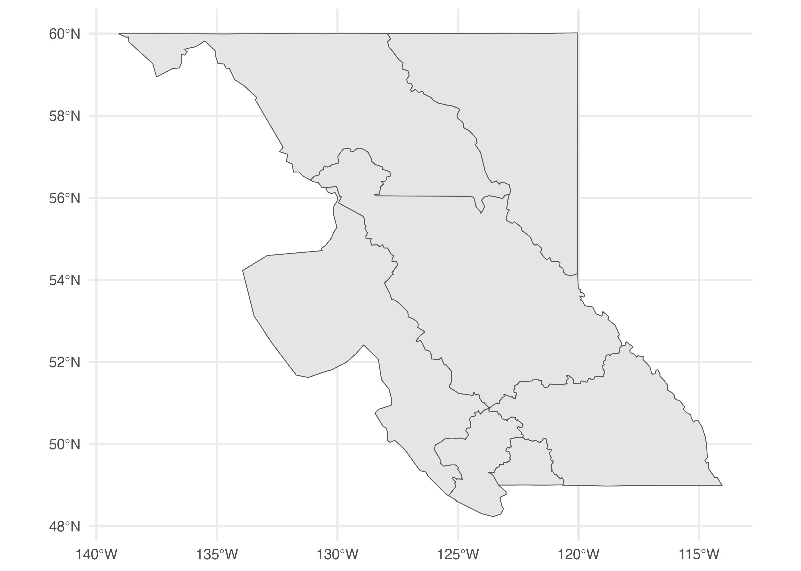

<!--
Copyright 2019 Province of British Columbia

Licensed under the Apache License, Version 2.0 (the "License");
you may not use this file except in compliance with the License.
You may obtain a copy of the License at

http://www.apache.org/licenses/LICENSE-2.0

Unless required by applicable law or agreed to in writing, software distributed under the License is distributed on an "AS IS" BASIS,
WITHOUT WARRANTIES OR CONDITIONS OF ANY KIND, either express or implied.
See the License for the specific language governing permissions and limitations under the License.
-->


The `bcdata` [R](https://www.r-project.org/) package contains functions for searching & retrieving data from the [B.C. Data Catalogue]( https://catalogue.data.gov.bc.ca).

The [B.C. Data Catalogue](https://www2.gov.bc.ca/gov/content?id=79B5224167334667A44C9E8B5143D0C5) is the place to find British Columbia Government data, applications and web services. Much of the data are released under the [Open Government Licence --- British Columbia](https://www2.gov.bc.ca/gov/content/data/open-data/open-government-licence-bc), as well as numerous other [licences](https://catalogue.data.gov.bc.ca/dataset?download_audience=Public).


You can install `bcdata` directly from CRAN:


```r
install.packages("bcdata")

library(bcdata)
```

### `bcdc_browse()`

`bcdata::bcdc_browse()` let's you access the [B.C. Data Catalogue web interface](https://catalogue.data.gov.bc.ca) directly from R---opening the catalogue search page in your default browser:


```r
## Take me to the B.C. Data Catalogue home page
bcdc_browse()
```

If you know the catalogue "human-readable" record name or permanent ID you can open directly to the record web page:


```r
## Take me to the B.C. Winery Locations catalogue record using the record name
bcdc_browse("bc-winery-locations")

## Take me to the B.C. Winery Locations catalogue record using the record permanent ID
bcdc_browse("1d21922b-ec4f-42e5-8f6b-bf320a286157")
```

### `bcdc_search()`

`bcdc_search()` let's you search records in the B.C. Data Catalogue, returning the search results in your R session.

Let's search the catalogue for records that contain the word "recycling":


```r
## Give me the catalogue search results for 'recycling'
bcdc_search("recycling")
#> List of B.C. Data Catalogue Records
#> Number of records: 3
#> Titles:
#> 1: Tire Stewardship BC Tire Recycling Data (csv)
#>  ID: f791329b-c2dc-4f82-9993-209780f2a1c6
#>  Name: tire-stewardship-bc-tire-recycling-data
#> 2: BC FIRST Tire Recycling Data 1991-2006 (csv)
#>  ID: a29ad492-29a2-44b9-8693-d27a8cc8e686
#>  Name: bc-first-tire-recycling-data-1991-2006
#> 3: Environmental Protection Information Resources e-Library (other)
#>  ID: dae0f2c3-b4f4-4d16-a96d-d7fe7c1581f3
#>  Name: environmental-protection-information-resources-e-library
#> 
#> Access a single record by calling `bcdc_get_record(ID)` with the ID from the desired
#>  record.
```

You can set the number of records to be returned from the search and/or you can customize your search using the catalogue search _facets_ `license_id`, `download_audience`, `res_format`, `sector`, and `organization`:


```r
## Give me the first catalogue search result for 'recycling'
bcdc_search("recycling", n = 1)
#> List of B.C. Data Catalogue Records
#> Number of records: 1
#> Titles:
#> 1: Tire Stewardship BC Tire Recycling Data (csv)
#>  ID: f791329b-c2dc-4f82-9993-209780f2a1c6
#>  Name: tire-stewardship-bc-tire-recycling-data
#> 
#> Access a single record by calling `bcdc_get_record(ID)` with the ID from the desired
#>  record.

## Give me the catalogue search results for 'recycling' where the
## data is licenced under Open Government Licence – British Columbia
bcdc_search("recycling", license_id = "2")
#> List of B.C. Data Catalogue Records
#> Number of records: 1
#> Titles:
#> 1: BC FIRST Tire Recycling Data 1991-2006 (csv)
#>  ID: a29ad492-29a2-44b9-8693-d27a8cc8e686
#>  Name: bc-first-tire-recycling-data-1991-2006
#> 
#> Access a single record by calling `bcdc_get_record(ID)` with the ID from the desired
#>  record.
```

You can see all valid values for the catalogue search facets using `bcdata::bcdc_search_facets()`:


```r
## Valid values for search facet 'license_id'
bcdc_search_facets(facet = "license_id")
#>         facet count                                             display_name name
#> 1  license_id    92                           Statistics Canada Open Licence   21
#> 2  license_id     1               Queen's Printer Licence - British Columbia   25
#> 3  license_id    12                      Open Government Licence – TransLink   48
#> 4  license_id    13 Open Government Licence – Municipality of North Cowichan   44
#> 5  license_id     5    Open Government Licence – Industry Training Authority   50
#> 6  license_id     3                 Open Government Licence - Destination BC   43
#> 7  license_id    61                         Open Government Licence - Canada   24
#> 8  license_id  1827               Open Government Licence - British Columbia    2
#> 9  license_id     2                  Open Government Licence - BC Assessment   47
#> 10 license_id     4                   Open Data Licence for ICBC Information   49
#> 11 license_id     2 Open Data Commons - Public Domain Dedication and Licence   45
#> 12 license_id    15                           Elections BC Open Data Licence   42
#> 13 license_id  1689                                              Access Only   22
```

Finally, you can retrieve the _metadata_ for a single catalogue record by using the record name or permanent ID with `bcdc_get_record()`. It is advised to use the permanent ID rather than the human-readable name in non-interactive situations---like scripts---to guard against future name changes of a record:


```r
## Give me the catalogue record metadata for `bc-first-tire-recycling-data-1991-2006`
bcdc_get_record("a29ad492-29a2-44b9-8693-d27a8cc8e686")
#> B.C. Data Catalogue Record: BC FIRST Tire Recycling Data 1991-2006
#> Name: bc-first-tire-recycling-data-1991-2006 (ID: a29ad492-29a2-44b9-8693-d27a8cc8e686)
#> Permalink: https://catalogue.data.gov.bc.ca/dataset/a29ad492-29a2-44b9-8693-d27a8cc8e686
#> Licence: Open Government Licence - British Columbia
#> Description: Financial Incentives for Recycling Scrap Tires (FIRST) collection and
#>  recycling data (tonnes) from 1991 to 2006. In 2007 [Tire Stewardship
#>  BC](http://www.tsbc.ca/), a not for profit society, launched the new scrap tire
#>  recycling program replacing the government-run program that had been in place since
#>  1991. Tire Stewardship BC collection and recycling data is available
#>  [here](https://catalogue.data.gov.bc.ca/dataset/f791329b-c2dc-4f82-9993-209780f2a1c6).
#> Available Resources (1):
#>  1. BC FIRST Tire Recycling Data 1991-2006 (csv)
#> Access the full 'Resources' data frame using:
#>  bcdc_tidy_resources('a29ad492-29a2-44b9-8693-d27a8cc8e686')
```

### `bcdc_get_data()`

Once you have located the B.C. Data Catalogue record with the data you want, you can use `bcdata::bcdc_get_data()` to download and read the data from the record.  You can use the record name, permanent ID or the result from `bcdc_get_record()`. Let's look at the B.C. Highway Web Cameras data:


```r
## Get the data resource for the `bc-highway-cams` catalogue record
bcdc_get_data("bc-highway-cams")
#> # A tibble: 978 × 21
#>       id highwayNum…¹ highw…² camName caption credit orien…³ latit…⁴ longi…⁵ eleva…⁶ image…⁷ timeO…⁸
#>    <dbl> <chr>        <chr>   <chr>   <chr>   <chr>  <chr>     <dbl>   <dbl>   <dbl> <chr>   <chr>  
#>  1     2 5            Coquih… Coquih… Hwy 5,…  <NA>  N          49.6   -121.     980 f4e581… 2022-0…
#>  2     5 3            <NA>    Kooten… Hwy 3,…  <NA>  E          49.1   -117.    1781 f1322d… 2022-0…
#>  3     6 16           <NA>    Smithe… Hwy 16…  <NA>  N          54.8   -127.     497 5f3cb5… 2022-0…
#>  4     7 1            Fraser… Cole R… Hwy 1 …  <NA>  E          49.1   -122.      12 771e32… 2022-0…
#>  5     8 1            Vancou… Malaha… Hwy 1 …  <NA>  N          48.6   -124.     327 a4b785… 2022-0…
#>  6     9 19           <NA>    Nanaim… Hwy 19…  <NA>  N          49.2   -124.     130 83714f… 2022-0…
#>  7    10 97           Northe… South … Hwy 97…  <NA>  N          56.1   -121.     714 55a7f6… 2022-0…
#>  8    11 1            Trans … Revels… Hwy 1 …  <NA>  NE         51.0   -118.     450 bd7314… 2022-0…
#>  9    12 1            Trans … Three … Hwy 1,…  <NA>  E          50.9   -118.     510 569d16… 2022-0…
#> 10    13 99           Peace … Peace … Hwy 99… "For … N          49.0   -123.      10 91e9eb… 2022-0…
#> # … with 968 more rows, 9 more variables: secondsSinceLastAttempt <dbl>, lastModified <chr>,
#> #   secondsSinceLastModified <dbl>, markedStale <dbl>, markedDelayed <dbl>, updatePeriodMean <dbl>,
#> #   updatePeriodStdDev <dbl>, fetchMean <dbl>, dbcMark <chr>, and abbreviated variable names
#> #   ¹​highwayNumber, ²​highwayLocationDescription, ³​orientation, ⁴​latitude, ⁵​longitude, ⁶​elevation,
#> #   ⁷​imageMD5, ⁸​timeOfLastAttempt

## OR use the permanent ID, which is better for scripts or non-interactive use
bcdc_get_data("6b39a910-6c77-476f-ac96-7b4f18849b1c")
#> # A tibble: 978 × 21
#>       id highwayNum…¹ highw…² camName caption credit orien…³ latit…⁴ longi…⁵ eleva…⁶ image…⁷ timeO…⁸
#>    <dbl> <chr>        <chr>   <chr>   <chr>   <chr>  <chr>     <dbl>   <dbl>   <dbl> <chr>   <chr>  
#>  1     2 5            Coquih… Coquih… Hwy 5,…  <NA>  N          49.6   -121.     980 f4e581… 2022-0…
#>  2     5 3            <NA>    Kooten… Hwy 3,…  <NA>  E          49.1   -117.    1781 f1322d… 2022-0…
#>  3     6 16           <NA>    Smithe… Hwy 16…  <NA>  N          54.8   -127.     497 5f3cb5… 2022-0…
#>  4     7 1            Fraser… Cole R… Hwy 1 …  <NA>  E          49.1   -122.      12 771e32… 2022-0…
#>  5     8 1            Vancou… Malaha… Hwy 1 …  <NA>  N          48.6   -124.     327 a4b785… 2022-0…
#>  6     9 19           <NA>    Nanaim… Hwy 19…  <NA>  N          49.2   -124.     130 83714f… 2022-0…
#>  7    10 97           Northe… South … Hwy 97…  <NA>  N          56.1   -121.     714 55a7f6… 2022-0…
#>  8    11 1            Trans … Revels… Hwy 1 …  <NA>  NE         51.0   -118.     450 bd7314… 2022-0…
#>  9    12 1            Trans … Three … Hwy 1,…  <NA>  E          50.9   -118.     510 569d16… 2022-0…
#> 10    13 99           Peace … Peace … Hwy 99… "For … N          49.0   -123.      10 91e9eb… 2022-0…
#> # … with 968 more rows, 9 more variables: secondsSinceLastAttempt <dbl>, lastModified <chr>,
#> #   secondsSinceLastModified <dbl>, markedStale <dbl>, markedDelayed <dbl>, updatePeriodMean <dbl>,
#> #   updatePeriodStdDev <dbl>, fetchMean <dbl>, dbcMark <chr>, and abbreviated variable names
#> #   ¹​highwayNumber, ²​highwayLocationDescription, ³​orientation, ⁴​latitude, ⁵​longitude, ⁶​elevation,
#> #   ⁷​imageMD5, ⁸​timeOfLastAttempt

## OR use the result from bcdc_get_record()
my_record <- bcdc_get_record("6b39a910-6c77-476f-ac96-7b4f18849b1c")
bcdc_get_data(my_record)
#> # A tibble: 978 × 21
#>       id highwayNum…¹ highw…² camName caption credit orien…³ latit…⁴ longi…⁵ eleva…⁶ image…⁷ timeO…⁸
#>    <dbl> <chr>        <chr>   <chr>   <chr>   <chr>  <chr>     <dbl>   <dbl>   <dbl> <chr>   <chr>  
#>  1     2 5            Coquih… Coquih… Hwy 5,…  <NA>  N          49.6   -121.     980 f4e581… 2022-0…
#>  2     5 3            <NA>    Kooten… Hwy 3,…  <NA>  E          49.1   -117.    1781 f1322d… 2022-0…
#>  3     6 16           <NA>    Smithe… Hwy 16…  <NA>  N          54.8   -127.     497 5f3cb5… 2022-0…
#>  4     7 1            Fraser… Cole R… Hwy 1 …  <NA>  E          49.1   -122.      12 771e32… 2022-0…
#>  5     8 1            Vancou… Malaha… Hwy 1 …  <NA>  N          48.6   -124.     327 a4b785… 2022-0…
#>  6     9 19           <NA>    Nanaim… Hwy 19…  <NA>  N          49.2   -124.     130 83714f… 2022-0…
#>  7    10 97           Northe… South … Hwy 97…  <NA>  N          56.1   -121.     714 55a7f6… 2022-0…
#>  8    11 1            Trans … Revels… Hwy 1 …  <NA>  NE         51.0   -118.     450 bd7314… 2022-0…
#>  9    12 1            Trans … Three … Hwy 1,…  <NA>  E          50.9   -118.     510 569d16… 2022-0…
#> 10    13 99           Peace … Peace … Hwy 99… "For … N          49.0   -123.      10 91e9eb… 2022-0…
#> # … with 968 more rows, 9 more variables: secondsSinceLastAttempt <dbl>, lastModified <chr>,
#> #   secondsSinceLastModified <dbl>, markedStale <dbl>, markedDelayed <dbl>, updatePeriodMean <dbl>,
#> #   updatePeriodStdDev <dbl>, fetchMean <dbl>, dbcMark <chr>, and abbreviated variable names
#> #   ¹​highwayNumber, ²​highwayLocationDescription, ³​orientation, ⁴​latitude, ⁵​longitude, ⁶​elevation,
#> #   ⁷​imageMD5, ⁸​timeOfLastAttempt
```

A catalogue record can have one or multiple data files---or "resources". If there is only one resource, `bcdc_get_data()` will return that resource by default, as in the above `bc-highway-cams` example. If there are multiple data resources you will need to specify which resource you want. Let's look at a catalogue record that contains multiple data resources---BC Schools - Programs Offered in Schools:


```r
## Get the record ID for the `bc-schools-programs-offered-in-schools` catalogue record
bcdc_search("school programs", n = 1)
#> List of B.C. Data Catalogue Records
#> Number of records: 1
#> Titles:
#> 1: BC Schools - Programs Offered in Schools (txt, xlsx)
#>  ID: b1f27d1c-244a-410e-a361-931fac62a524
#>  Name: bc-schools-programs-offered-in-schools
#> 
#> Access a single record by calling `bcdc_get_record(ID)` with the ID from the desired
#>  record.

## Get the metadata for the `bc-schools-programs-offered-in-schools` catalogue record
bcdc_get_record("b1f27d1c-244a-410e-a361-931fac62a524")
#> B.C. Data Catalogue Record: BC Schools - Programs Offered in Schools
#> Name: bc-schools-programs-offered-in-schools (ID: b1f27d1c-244a-410e-a361-931fac62a524)
#> Permalink: https://catalogue.data.gov.bc.ca/dataset/b1f27d1c-244a-410e-a361-931fac62a524
#> Licence: Open Government Licence - British Columbia
#> Description: BC Schools English Language Learners, French Immersion, Francophone, Career
#>  Preparation, Aboriginal Support Services, Aboriginal Language and Culture, Continuing
#>  Education and Career Technical Programs offered in BC schools up to 2013/2014.
#> Available Resources (2):
#>  1. ProgramsOfferedinSchools.txt (txt)
#>  2. ProgramsOfferedinSchools.xlsx (xlsx)
#> Access the full 'Resources' data frame using:
#>  bcdc_tidy_resources('b1f27d1c-244a-410e-a361-931fac62a524')
```

We see there are two data files or resources available in this record, so we need to tell `bcdc_get_data()` which one we want. When used interactively, `bcdc_get_data()` will prompt you with the list of available resources through `bcdata` and ask you to select the resource you want. The resource ID for each data set is available _in_ the metadata record ☝️:


```r
## Get the txt data resource from the `bc-schools-programs-offered-in-schools`
## catalogue record
bcdc_get_data("b1f27d1c-244a-410e-a361-931fac62a524", resource = 'a393f8cf-51ec-42c6-8449-4cea4c75385c')
#> # A tibble: 16,152 × 24
#>    Data Le…¹ Schoo…² Facil…³ Publi…⁴ Distr…⁵ Distr…⁶ Schoo…⁷ Schoo…⁸ Has E…⁹ Has C…˟ Has E…˟ Has L…˟
#>    <chr>     <chr>   <chr>   <chr>   <chr>   <chr>   <chr>   <chr>   <lgl>   <lgl>   <lgl>   <lgl>  
#>  1 SCHOOL L… 2005/2… STANDA… BC Pub… 005     Southe… 005010… Sparwo… NA      TRUE    NA      NA     
#>  2 SCHOOL L… 2006/2… STANDA… BC Pub… 005     Southe… 005010… Sparwo… NA      TRUE    NA      NA     
#>  3 SCHOOL L… 2007/2… STANDA… BC Pub… 005     Southe… 005010… Sparwo… NA      TRUE    NA      NA     
#>  4 SCHOOL L… 2005/2… STANDA… BC Pub… 005     Southe… 005010… Jaffra… NA      TRUE    NA      NA     
#>  5 SCHOOL L… 2006/2… STANDA… BC Pub… 005     Southe… 005010… Jaffra… NA      TRUE    NA      NA     
#>  6 SCHOOL L… 2007/2… STANDA… BC Pub… 005     Southe… 005010… Jaffra… NA      TRUE    NA      NA     
#>  7 SCHOOL L… 2008/2… STANDA… BC Pub… 005     Southe… 005010… Jaffra… NA      TRUE    NA      NA     
#>  8 SCHOOL L… 2009/2… STANDA… BC Pub… 005     Southe… 005010… Jaffra… NA      TRUE    NA      NA     
#>  9 SCHOOL L… 2010/2… STANDA… BC Pub… 005     Southe… 005010… Jaffra… NA      TRUE    NA      NA     
#> 10 SCHOOL L… 2011/2… STANDA… BC Pub… 005     Southe… 005010… Jaffra… NA      TRUE    NA      NA     
#> # … with 16,142 more rows, 12 more variables: `Has Prog Francophone` <lgl>,
#> #   `Has Any French Immersion Prog` <lgl>, `Has Any French Prog` <lgl>,
#> #   `Has Aborig Supp Services` <lgl>, `Has Other Appr Aborig Prog` <lgl>,
#> #   `Has Aborig Lang And Cult` <lgl>, `Has Continuing Ed Prog` <lgl>,
#> #   `Has Distributed Learn Prog` <lgl>, `Has Career Prep Prog` <lgl>, `Has Coop Prog` <lgl>,
#> #   `Has Apprenticeship Prog` <lgl>, `Has Career Technical Prog` <lgl>, and abbreviated variable
#> #   names ¹​`Data Level`, ²​`School Year`, ³​`Facility Type`, ⁴​`Public Or Independent`, …
```

Alternatively, you can retrieve the full details of the available resources for a given record as a data frame using `bcdc_tidy_resources()`:


```r
## Get a data frame of data resources for the `bc-schools-programs-offered-in-schools`
## catalogue record
bcdc_tidy_resources("b1f27d1c-244a-410e-a361-931fac62a524")
#> # A tibble: 2 × 9
#>   name                          url               id    format ext   packa…¹ locat…² wfs_a…³ bcdat…⁴
#>   <chr>                         <chr>             <chr> <chr>  <chr> <chr>   <chr>   <lgl>   <lgl>  
#> 1 ProgramsOfferedinSchools.txt  http://www.bced.… a393… txt    txt   b1f27d… catalo… FALSE   TRUE   
#> 2 ProgramsOfferedinSchools.xlsx http://www.bced.… 1e34… xlsx   xlsx  b1f27d… catalo… FALSE   TRUE   
#> # … with abbreviated variable names ¹​package_id, ²​location, ³​wfs_available, ⁴​bcdata_available
```

`bcdc_get_data()` will also detect if the data resource is a geospatial file, and automatically reads and returns it as an [`sf` object](https://r-spatial.github.io/sf/) in your R session.

Let's get the air zones for British Columbia:


```r
## Find the B.C. Air Zones catalogue record
bcdc_search("air zones", res_format = "geojson")
#> List of B.C. Data Catalogue Records
#> Number of records: 1
#> Titles:
#> 1: British Columbia Air Zones (shp, kml, geojson)
#>  ID: e8eeefc4-2826-47bc-8430-85703d328516
#>  Name: british-columbia-air-zones
#> 
#> Access a single record by calling `bcdc_get_record(ID)` with the ID from the desired
#>  record.

## Get the metadata for the B.C. Air Zones catalogue record
bc_az_metadata <- bcdc_get_record("e8eeefc4-2826-47bc-8430-85703d328516")

## Get the B.C. Air Zone geospatial data
bc_az <- bcdc_get_data(bc_az_metadata, resource = "c495d082-b586-4df0-9e06-bd6b66a8acd9")

## Plot the B.C. Air Zone geospatial data with ggplot()
bc_az %>%
  ggplot() +
  geom_sf() +
  theme_minimal()
```




**Note:** The `bcdata` package supports downloading _most_ file types, including zip archives. It will do its best to identify and read data from
zip files, however if there are multiple data files in the zip, or data files that `bcdata` doesn't know how to import, it will fail.


### `bcdc_query_geodata()`

Many geospatial data sets in the B.C. Data Catalogue are available through a [Web Feature Service](https://en.wikipedia.org/wiki/Web_Feature_Service). While `bcdc_get_data()` will retrieve the geospatial data for you, sometimes the geospatial file is very large---and slow to download---and/or you may only want _some_ of the data. `bcdc_query_geodata()` let's you query catalogue geospatial data available as a Web Feature Service using `select` and `filter` functions (just like in [`dplyr`](https://dplyr.tidyverse.org/). The `bcdc::collect()` function returns the `bcdc_query_geodata()` query results as an [`sf` object](https://r-spatial.github.io/sf/) in your R session.

Let's get the Capital Regional District boundary from the [B.C. Regional Districts geospatial data](https://catalogue.data.gov.bc.ca/dataset/d1aff64e-dbfe-45a6-af97-582b7f6418b9)---the whole file takes 30-60 seconds to download and I only need the one polygon, so why not save some time:


```r
## Find the B.C. Regional Districts catalogue record
bcdc_search("regional districts administrative areas", res_format = "wms", n = 1)
#> List of B.C. Data Catalogue Records
#> Number of records: 1
#> Titles:
#> 1: Regional Districts - Legally Defined Administrative Areas of BC (multiple, xlsx, wms,
#>  kml)
#>  ID: d1aff64e-dbfe-45a6-af97-582b7f6418b9
#>  Name: regional-districts-legally-defined-administrative-areas-of-bc
#> 
#> Access a single record by calling `bcdc_get_record(ID)` with the ID from the desired
#>  record.

## Get the metadata for the B.C. Regional Districts catalogue record
bc_regional_districts_metadata <- bcdc_get_record("d1aff64e-dbfe-45a6-af97-582b7f6418b9")

## We can see in the search results, and in the metadata record, that this record has a `"wms"`
## resource format, indicating that it is available as a Web Feature Service and thus
## we can query it using `bcdc_query_geodata()`

## Have a quick look at the geospatial columns to help with filter or select
bcdc_describe_feature(bc_regional_districts_metadata)
#> # A tibble: 21 × 5
#>    col_name                 sticky remote_col_type local_col_type column_comments                   
#>    <chr>                    <lgl>  <chr>           <chr>          <chr>                             
#>  1 id                       TRUE   xsd:string      character       <NA>                             
#>  2 LGL_ADMIN_AREA_ID        TRUE   xsd:decimal     numeric        "An operationally-generated uniqu…
#>  3 ADMIN_AREA_NAME          FALSE  xsd:string      character      "The authoritative, officially ap…
#>  4 ADMIN_AREA_ABBREVIATION  FALSE  xsd:string      character      "A short form or commonly-known a…
#>  5 ADMIN_AREA_BOUNDARY_TYPE FALSE  xsd:string      character      "BOUNDARY TYPE is a high-level gr…
#>  6 ADMIN_AREA_GROUP_NAME    FALSE  xsd:string      character      "The name given to the larger adm…
#>  7 CHANGE_REQUESTED_ORG     FALSE  xsd:string      character      "The government acronym of the Mi…
#>  8 UPDATE_TYPE              FALSE  xsd:string      character      "A short description of the lates…
#>  9 WHEN_UPDATED             FALSE  xsd:date        date           "The date and time the record was…
#> 10 MAP_STATUS               FALSE  xsd:string      character      "That the digital map has been ap…
#> # … with 11 more rows

## Get the Capital Regional District polygon from the B.C. Regional
## Districts geospatial data
my_regional_district <- bcdc_query_geodata(bc_regional_districts_metadata) %>%
  filter(ADMIN_AREA_NAME == "Capital Regional District") %>%
  collect()

## Plot the Capital Regional District polygon with ggplot()
my_regional_district  %>%
  ggplot() +
  geom_sf() +
  theme_minimal()
```


The vignette [Querying Spatial Data with bcdata](https://bcgov.github.io/bcdata/articles/efficiently-query-spatial-data-in-the-bc-data-catalogue.html) provides a full demonstration on how to use `bcdata::bcdc_query_geodata()` to fine tune a [Web Feature Service](https://www2.gov.bc.ca/gov/content?id=95D78D544B244F34B89223EF069DF74E) request for geospatial data from the B.C. Data Catalogue.
