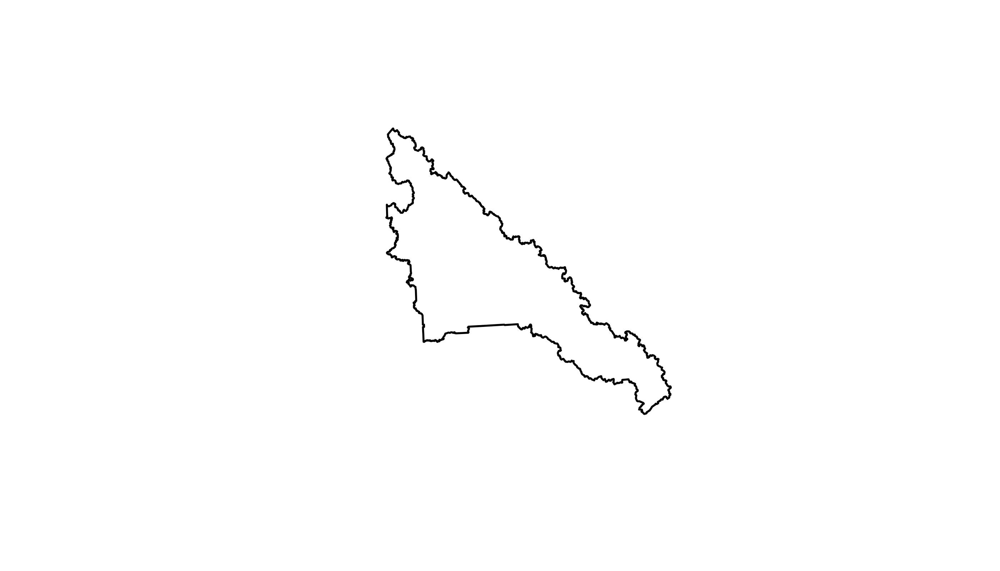
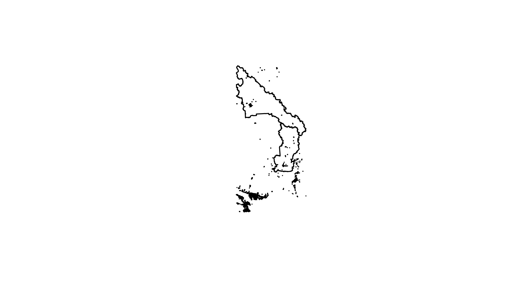
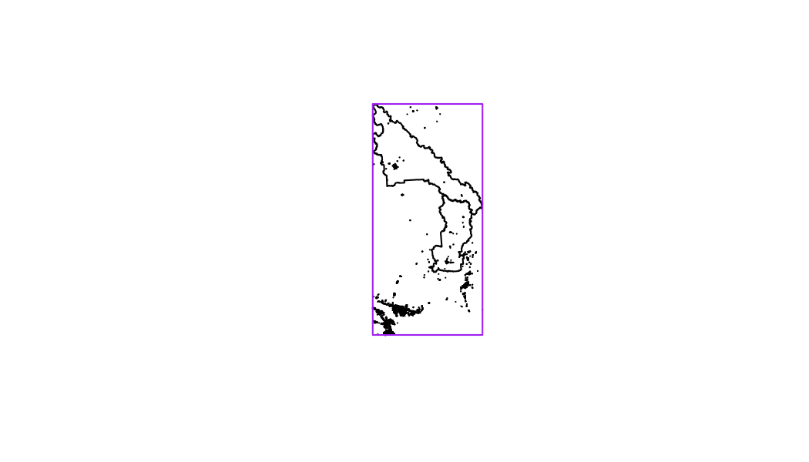
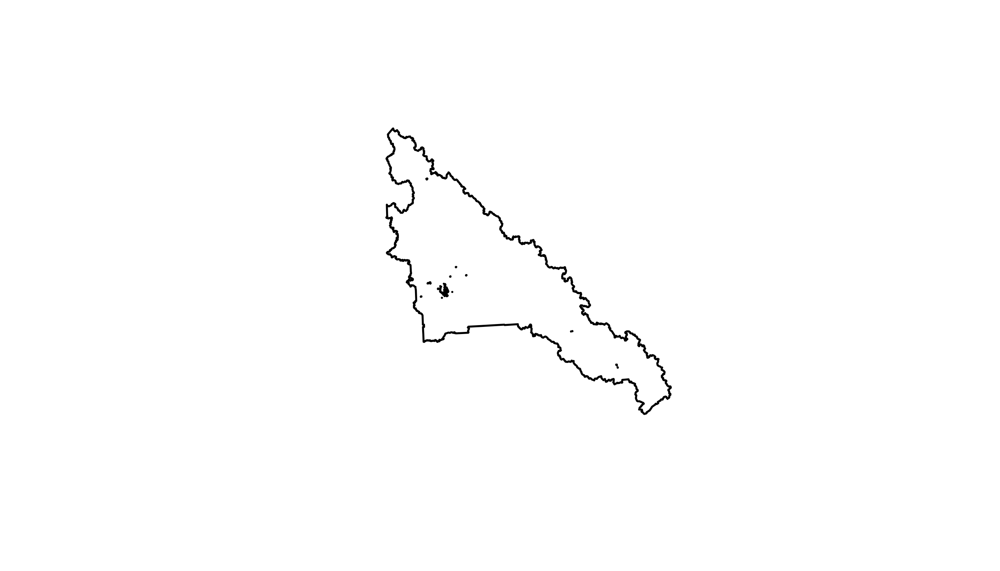

<!--
Copyright 2019 Province of British Columbia

Licensed under the Apache License, Version 2.0 (the "License");
you may not use this file except in compliance with the License.
You may obtain a copy of the License at

http://www.apache.org/licenses/LICENSE-2.0

Unless required by applicable law or agreed to in writing, software distributed under the License is distributed on an "AS IS" BASIS,
WITHOUT WARRANTIES OR CONDITIONS OF ANY KIND, either express or implied.
See the License for the specific language governing permissions and limitations under the License.
-->


This vignette illustrates how to use `bcdata::bcdc_query_geodata` to request and query [Web Service-enabled](https://www2.gov.bc.ca/gov/content?id=95D78D544B244F34B89223EF069DF74E) geospatial data from the [B.C. Data Catalogue](https://catalogue.data.gov.bc.ca/dataset). To illustrate, we will request and merge two spatial data sets from the catalogue---school district and greenspaces spatial data---and then examine the amount of park space contained within the boundaries of the Greater Victoria, Prince George and Kamloops/Thompson British Columbia school districts.

## Getting Started
First you need to load the package. We will also load the `sf` and `dplyr` packages to help us work with spatial data. You can learn more about the `sf` package [here](https://r-spatial.github.io/sf/) and `dplyr` [here](https://dplyr.tidyverse.org/):


```r
library(bcdata)
library(sf)
library(dplyr)
```


## Geospatial Data in the B.C. Data Catalogue
The [B.C. Data Catalogue](https://catalogue.data.gov.bc.ca/dataset) provides many data sets with spatial information through a [Web Service](https://www2.gov.bc.ca/gov/content?id=95D78D544B244F34B89223EF069DF74E). Technically speaking, this means if we have an internet connection we can issue [HTTP](https://en.wikipedia.org/wiki/Hypertext_Transfer_Protocol) requests to the catalogue and seamlessly import the response data into R as an `sf` objects. The `bcdata` package provides a means to a) choose which layer you want and b) use `dplyr` verbs to specifically tailor your request.  A `dbplyr` backend is implemented so that requests are executed lazily meaning results are not transferred over the web until the user specifically calls the `collect` function. This approach mimics the `dplyr` verb translation to `SQL` seen for many database types. A good introduction to principles of `dbplyr` is available [here](https://cran.r-project.org/package=dbplyr/vignettes/dbplyr.html).

## School District Data
Our first step is to extract the [school district polygons](https://catalog.data.gov.bc.ca/dataset/78ec5279-4534-49a1-97e8-9d315936f08b) from the B.C. Data Catalogue. This layer is described using this command:


```r
bcdc_get_record("78ec5279-4534-49a1-97e8-9d315936f08b")
#> B.C. Data Catalogue Record: School Districts of BC
#> Name: school-districts-of-bc (ID: 78ec5279-4534-49a1-97e8-9d315936f08b)
#> Permalink:
#>  https://catalogue.data.gov.bc.ca/dataset/78ec5279-4534-49a1-97e8-9d315936f08b
#> Sector: Education
#> Licence: Open Government Licence - British Columbia
#> Type: Geographic
#> Last Updated: 2020-11-03
#> Description: The School Districts dataset contains the spatial representation
#>  (polygon) of the current extent of the administrative areas defined under section
#>  176(1) of the School Act for the purposes of preservation and promotion of the
#>  fundamental principle of local autonomy and control of public education at the public
#>  and governmental levels through locally elected school boards.
#> Resources: (3)
#> # A tibble: 3 x 8
#>   name       url                id         format ext   package_id     location  bcdata_available
#>   <chr>      <chr>              <chr>      <chr>  <chr> <chr>          <chr>     <lgl>           
#> 1 BC Geogra~ https://catalogue~ 529507c4-~ other  ""    78ec5279-4534~ bcgeogra~ FALSE           
#> 2 WMS getCa~ https://openmaps.~ 57d8843b-~ wms    ""    78ec5279-4534~ bcgeogra~ TRUE            
#> 3 KML Netwo~ http://openmaps.g~ 7493e749-~ kml    "kml" 78ec5279-4534~ bcgeogra~ FALSE           
#> You can access the 'Resources' data frame using bcdc_tidy_resources()
```

This data is the boundary of each school district. The key information in this metadata is that the layer is a `**WFS request (Spatial Data)**`---which means it is available through a [Web Service](https://www2.gov.bc.ca/gov/content?id=95D78D544B244F34B89223EF069DF74E). From this we know we can make use of `bcdc_query_geodata`.


```r
bcdc_query_geodata("78ec5279-4534-49a1-97e8-9d315936f08b")
#> Querying 'school-districts-of-bc' record
#> * Using collect() on this object will return 59 features and 9 fields
#> * At most six rows of the record are printed here
#> -------------------------------------------------------------------------------------------------
#> Simple feature collection with 6 features and 9 fields
#> Geometry type: POLYGON
#> Dimension:     XY
#> Bounding box:  xmin: 956376 ymin: 475108.4 xmax: 1635228 ymax: 901924.4
#> Projected CRS: NAD83 / BC Albers
#> # A tibble: 6 x 10
#>   id              ADMIN_AREA_SID SCHOOL_DISTRICT_~ SCHOOL_DISTRICT~ FEATURE_CODE FEATURE_AREA_SQM
#>   <chr>                    <int> <chr>                        <int> <chr>                   <dbl>
#> 1 WHSE_TANTALIS.~            300 Arrow Lakes                     10 FH10000300        7392472526.
#> 2 WHSE_TANTALIS.~            301 Revelstoke                      19 FH10000300        9416076465.
#> 3 WHSE_TANTALIS.~            302 Kootenay-Columbia               20 FH10000300        3072672101.
#> 4 WHSE_TANTALIS.~            303 Vernon                          22 FH10000300        5588468673.
#> 5 WHSE_TANTALIS.~            304 Central Okanagan                23 FH10000300        2916757936.
#> 6 WHSE_TANTALIS.~            305 Cariboo-Chilcotin               27 FH10000300       61213520885.
#> # ... with 4 more variables: FEATURE_LENGTH_M <dbl>, OBJECTID <int>, SE_ANNO_CAD_DATA <chr>,
#> #   geometry <POLYGON [m]>
```

This is the initial query to the data in the catalogue. What has been returned is *not* the actual data but rather a subset to help you tune your query. The printed output of this query offers several useful pieces of information. Because we have queried with a unique ID, we are shown the name of the record. We also receive instruction that using `collect()` will retrieve a given number of features and fields present for this query. Lastly, there is a reminder that what is printed is only the first 6 rows of the record. Since we are limiting the scope of analysis to the Greater Victoria, Prince George and Kamloops/Thompson school districts, we want to ask the catalogue for only those polygons just like we would in a typical `dplyr` workflow:


```r
bcdc_query_geodata("78ec5279-4534-49a1-97e8-9d315936f08b") %>%
  filter(SCHOOL_DISTRICT_NAME %in% c("Greater Victoria", "Prince George","Kamloops/Thompson"))
#> Querying 'school-districts-of-bc' record
#> * Using collect() on this object will return 1 features and 9 fields
#> * At most six rows of the record are printed here
#> -------------------------------------------------------------------------------------------------
#> Simple feature collection with 1 feature and 9 fields
#> Geometry type: POLYGON
#> Dimension:     XY
#> Bounding box:  xmin: 1126789 ymin: 821142.1 xmax: 1528155 ymax: 1224202
#> Projected CRS: NAD83 / BC Albers
#> # A tibble: 1 x 10
#>   id              ADMIN_AREA_SID SCHOOL_DISTRICT_~ SCHOOL_DISTRICT~ FEATURE_CODE FEATURE_AREA_SQM
#>   <chr>                    <int> <chr>                        <int> <chr>                   <dbl>
#> 1 WHSE_TANTALIS.~            328 Prince George                   57 FH10000300       51888780641.
#> # ... with 4 more variables: FEATURE_LENGTH_M <dbl>, OBJECTID <int>, SE_ANNO_CAD_DATA <chr>,
#> #   geometry <POLYGON [m]>
```

To further tune our query, we can also request only the columns we want. Really we only want the school district column and the spatial information. During an actual analysis, it is possible that you may need to initially collect more data than you want to determine value to subset by. For example, there is currently no way to ask the catalogue for all possible unique values of `SCHOOL_DISTRICT_NAME`. Is that case the data will need to be brought into R and unique values will need to be determined there.


```r
bcdc_query_geodata("78ec5279-4534-49a1-97e8-9d315936f08b") %>%
  filter(SCHOOL_DISTRICT_NAME %in% c("Greater Victoria", "Prince George","Kamloops/Thompson")) %>%
  select(SCHOOL_DISTRICT_NAME)
#> Querying 'school-districts-of-bc' record
#> * Using collect() on this object will return 1 features and 5 fields
#> * At most six rows of the record are printed here
#> -------------------------------------------------------------------------------------------------
#> Simple feature collection with 1 feature and 5 fields
#> Geometry type: POLYGON
#> Dimension:     XY
#> Bounding box:  xmin: 1126789 ymin: 821142.1 xmax: 1528155 ymax: 1224202
#> Projected CRS: NAD83 / BC Albers
#> # A tibble: 1 x 6
#>   id       ADMIN_AREA_SID SCHOOL_DISTRICT_~ SCHOOL_DISTRICT~ OBJECTID                    geometry
#>   <chr>             <int> <chr>                        <int>    <int>               <POLYGON [m]>
#> 1 WHSE_TA~            328 Prince George                   57      562 ((1137478 1221549, 1137399~
```

Note that in the `select` statement, we did not explicitly ask for the spatial data and also that there are several columns present that we didn't select. This is because within each data set in the data catalogue, there are several columns that will always be returned regardless of what is selected. If you really don't want those columns after you `collect` the data, which we will take care of right now, you can drop them:


```r
districts <- bcdc_query_geodata("78ec5279-4534-49a1-97e8-9d315936f08b") %>%
  filter(SCHOOL_DISTRICT_NAME %in% c("Greater Victoria", "Prince George","Kamloops/Thompson")) %>%
  select(SCHOOL_DISTRICT_NAME) %>%
  collect()
```

Again note here that we have assigned the object a name and added the `collect` statement. This step happens when you have selected the data you want and wish to begin working with it in R like a normal `sf` object. For example, we can now plot these three school districts:


```r
plot(st_geometry(districts))
```



Now that we have the spatial boundaries narrowed by specific school districts we can perform some spatial operations to determine parks in the school districts.

## Greenspaces Data
For the purposes of this example, let's consider [this greenspace](https://catalogue.data.gov.bc.ca/dataset/6a2fea1b-0cc4-4fc2-8017-eaf755d516da) layer in the catalogue. This layer is described here:


```r
bcdc_get_record("6a2fea1b-0cc4-4fc2-8017-eaf755d516da")
#> B.C. Data Catalogue Record: Local and Regional Greenspaces
#> Name: local-and-regional-greenspaces (ID: 6a2fea1b-0cc4-4fc2-8017-eaf755d516da)
#> Permalink:
#>  https://catalogue.data.gov.bc.ca/dataset/6a2fea1b-0cc4-4fc2-8017-eaf755d516da
#> Sector: Natural Resources
#> Licence: Open Government Licence - British Columbia
#> Type: Geographic
#> Last Updated: 2020-11-25
#> Description: This dataset contains spatial and attribute information for local and
#>  regional greenspaces in British Columbia. Local and regional greenspaces are
#>  municipal or regional district lands designated by local government agencies and
#>  managed for public enjoyment, ecosystem or wildlife values. Spatial boundaries were
#>  sourced from municipal and regional district web sites, which in some cases provide
#>  datasets under Open Government Licence, and in other cases, publicize parks and
#>  greenspaces on web maps or pdf maps. Boundaries were edge-matched to the ParcelMap BC
#>  cadastre.  This spatial layer contains multipart polygons.
#> Resources: (4)
#> # A tibble: 4 x 8
#>   name       url                id         format ext    package_id    location  bcdata_available
#>   <chr>      <chr>              <chr>      <chr>  <chr>  <chr>         <chr>     <lgl>           
#> 1 WMS getCa~ https://openmaps.~ a8d5b53e-~ wms    ""     6a2fea1b-0cc~ bcgeogra~ TRUE            
#> 2 KML Netwo~ http://openmaps.g~ a7454e41-~ kml    "kml"  6a2fea1b-0cc~ bcgeogra~ FALSE           
#> 3 LocalRegi~ https://catalogue~ 76663191-~ xlsx   "xlsx" 6a2fea1b-0cc~ external  TRUE            
#> 4 BC Geogra~ https://catalogue~ 53c6c6bd-~ other  ""     6a2fea1b-0cc~ bcgeogra~ FALSE           
#> You can access the 'Resources' data frame using bcdc_tidy_resources()
```

Again we recognize this is [Web Service-enabled](https://www2.gov.bc.ca/gov/content?id=95D78D544B244F34B89223EF069DF74E) geospatial data, which means we can make use of `bcdc_query_geodata`.


```r
bcdc_query_geodata("6a2fea1b-0cc4-4fc2-8017-eaf755d516da")
#> Querying 'local-and-regional-greenspaces' record
#> * Using collect() on this object will return 8708 features and 19 fields
#> * At most six rows of the record are printed here
#> -------------------------------------------------------------------------------------------------
#> Simple feature collection with 6 features and 19 fields
#> Geometry type: POLYGON
#> Dimension:     XY
#> Bounding box:  xmin: 1228153 ymin: 453419.9 xmax: 1240644 ymax: 467184.1
#> Projected CRS: NAD83 / BC Albers
#> # A tibble: 6 x 20
#>   id        LOCAL_REG_GREENS~ PARK_NAME  PARK_TYPE PARK_PRIMARY_USE REGIONAL_DISTRI~ MUNICIPALITY
#>   <chr>                 <int> <chr>      <chr>     <chr>            <chr>            <chr>       
#> 1 WHSE_BAS~                59 Hazelnut ~ Local     Park             Metro Vancouver  Surrey      
#> 2 WHSE_BAS~                60 Hazelwood~ Local     Park             Metro Vancouver  Surrey      
#> 3 WHSE_BAS~                61 Hemlock P~ Local     Park             Metro Vancouver  Surrey      
#> 4 WHSE_BAS~                62 Heritage ~ Local     Park             Metro Vancouver  Surrey      
#> 5 WHSE_BAS~                63 Heron Park Local     Park             Metro Vancouver  Surrey      
#> 6 WHSE_BAS~                64 Hillcrest~ Local     Park             Metro Vancouver  Surrey      
#> # ... with 13 more variables: CIVIC_NUMBER <int>, CIVIC_NUMBER_SUFFIX <chr>, STREET_NAME <chr>,
#> #   LATITUDE <dbl>, LONGITUDE <dbl>, WHEN_UPDATED <date>, WEBSITE_URL <chr>,
#> #   LICENCE_COMMENTS <chr>, FEATURE_AREA_SQM <dbl>, FEATURE_LENGTH_M <dbl>, OBJECTID <int>,
#> #   SE_ANNO_CAD_DATA <chr>, geometry <POLYGON [m]>
```

Since we are interested in only "Park" data we can subset our query:


```r
bcdc_query_geodata("6a2fea1b-0cc4-4fc2-8017-eaf755d516da") %>%
  filter(PARK_PRIMARY_USE == "Park")
#> Querying 'local-and-regional-greenspaces' record
#> * Using collect() on this object will return 4373 features and 19 fields
#> * At most six rows of the record are printed here
#> -------------------------------------------------------------------------------------------------
#> Simple feature collection with 6 features and 19 fields
#> Geometry type: POLYGON
#> Dimension:     XY
#> Bounding box:  xmin: 1228153 ymin: 453419.9 xmax: 1240644 ymax: 467184.1
#> Projected CRS: NAD83 / BC Albers
#> # A tibble: 6 x 20
#>   id        LOCAL_REG_GREENS~ PARK_NAME  PARK_TYPE PARK_PRIMARY_USE REGIONAL_DISTRI~ MUNICIPALITY
#>   <chr>                 <int> <chr>      <chr>     <chr>            <chr>            <chr>       
#> 1 WHSE_BAS~                59 Hazelnut ~ Local     Park             Metro Vancouver  Surrey      
#> 2 WHSE_BAS~                60 Hazelwood~ Local     Park             Metro Vancouver  Surrey      
#> 3 WHSE_BAS~                61 Hemlock P~ Local     Park             Metro Vancouver  Surrey      
#> 4 WHSE_BAS~                62 Heritage ~ Local     Park             Metro Vancouver  Surrey      
#> 5 WHSE_BAS~                63 Heron Park Local     Park             Metro Vancouver  Surrey      
#> 6 WHSE_BAS~                64 Hillcrest~ Local     Park             Metro Vancouver  Surrey      
#> # ... with 13 more variables: CIVIC_NUMBER <int>, CIVIC_NUMBER_SUFFIX <chr>, STREET_NAME <chr>,
#> #   LATITUDE <dbl>, LONGITUDE <dbl>, WHEN_UPDATED <date>, WEBSITE_URL <chr>,
#> #   LICENCE_COMMENTS <chr>, FEATURE_AREA_SQM <dbl>, FEATURE_LENGTH_M <dbl>, OBJECTID <int>,
#> #   SE_ANNO_CAD_DATA <chr>, geometry <POLYGON [m]>
```

Here we see that this greatly reduces the number of features that we are dealing with (and correspondingly the amount of data that needs to be transferred over the web). Remember also that we still have not actually requested the full data set. This is just still a preview. Also this query still includes all municipal parks in BC while we only want the ones in the three school districts - the polygons defined by the `districts` object. To find that subset of parks we can make use of the built-in geometric operators which allow us to perform spatial operations remotely fine tuning our query even further. Here using the `INTERSECTS` function is appropriate and since this is a last tuning step, we can call `collect` and assign a name to this object. These requests can sometimes take quite a long:


```r
districts_parks <- bcdc_query_geodata("6a2fea1b-0cc4-4fc2-8017-eaf755d516da") %>%
  filter(PARK_PRIMARY_USE == "Park") %>%
  filter(INTERSECTS(districts)) %>%
  collect()
```

Plotting both the filtered parks data and the district polygons reveals an important consideration when using `bcdata`:



In this example, many parks not contained within the school districts are included in the `districts_parks` object. This is because rather than a full intersection, `bcdata` draws a bounding box around all the polygons that are doing the intersection (in this case `district`) and does the intersection based on that bounding box. This behaviour is imposed by the Web Feature Server but controlled via the `bcdata.max_geom_pred_size` option (See `?bcdc_options` for default values). Using this example, you can check to see if the size of the `districts` object exceeded the current value of `bcdata.max_geom_pred_size`:


```r
bcdc_size_check(districts)
#> The object is too large to perform exact spatial operations using bcdata.
#> Object size: 948576 bytes
#> BC Data Threshold: 5e+05 bytes
#> Exceedance: 448576 bytes
#> See ?bcdc_size_check for more details
```

Drawing the bounding box illustrates this point:



We are left with two options to get around this problem. First, we can simply do some additional processing with the `sf` package. Specifically we can use a spatial join to assign parks into their respective district:


```r
districts_parks_join <- districts_parks %>%
  st_join(districts, left = FALSE)
```



A second approach is to set an internal option (`bcdata.max_geom_pred_size`) and increase the threshold of when a bounding box is drawn. Options are set in R like this:

```r
options("bcdata.max_geom_pred_size" = {object size in bytes})
```

The value of `bcdata.max_geom_pred_size` is set conservatively so that requests to the Web Service are more consistently successful. Increasing this value may result in invalid requests.

Finally, to address our original question of which school district has the most municipal park space we can calculate the area of each park polygon and then sum those areas by school district:


```r
districts_parks_join %>%
  mutate(area = st_area(geometry)) %>%
  st_set_geometry(NULL) %>%
  group_by(SCHOOL_DISTRICT_NAME) %>%
  summarise(total_area = sum(area)) %>%
  arrange(total_area)
#> # A tibble: 1 x 2
#>   SCHOOL_DISTRICT_NAME total_area
#>   <chr>                     [m^2]
#> 1 Prince George          12254346
```

## Additional Useful Functions
There are a couple of other functions in `bcdata` that are useful to know when working with spatial data from the catalogue. `bcdc_describe_feature` gives the column names, whether the column is selectable, and the column types in both R and on the remote server:


```r
bcdc_describe_feature("6a2fea1b-0cc4-4fc2-8017-eaf755d516da")
#> # A tibble: 20 x 5
#>    col_name      sticky remote_col_type    local_col_type column_comments                        
#>    <chr>         <lgl>  <chr>              <chr>          <chr>                                  
#>  1 id            FALSE  xsd:string         character      <NA>                                   
#>  2 LOCAL_REG_GR~ FALSE  xsd:decimal        numeric        LOCAL_REG_GREENSPACE_ID is a system-ge~
#>  3 PARK_NAME     TRUE   xsd:string         character      PARK NAME is the name of the park, e.g~
#>  4 PARK_TYPE     TRUE   xsd:string         character      PARK_TYPE is the type of park, e.g., L~
#>  5 PARK_PRIMARY~ TRUE   xsd:string         character      PARK PRIMARY USE defines the primary u~
#>  6 REGIONAL_DIS~ TRUE   xsd:string         character      REGIONAL_DISTRICT is the name of the r~
#>  7 MUNICIPALITY  TRUE   xsd:string         character      MUNICIPALITY is the name of the munici~
#>  8 CIVIC_NUMBER  TRUE   xsd:decimal        numeric        CIVIC_NUMBER is the street number or n~
#>  9 CIVIC_NUMBER~ TRUE   xsd:string         character      CIVIC_NUMBER_SUFFIX is the letter or f~
#> 10 STREET_NAME   TRUE   xsd:string         character      STREET_NAME is the name of the street ~
#> 11 LATITUDE      TRUE   xsd:decimal        numeric        LATITUDE is the geographic coordinate,~
#> 12 LONGITUDE     TRUE   xsd:decimal        numeric        LONGITUDE is the geographic coordinate~
#> 13 WHEN_UPDATED  TRUE   xsd:date           date           WHEN_UPDATED is the date and time the ~
#> 14 WEBSITE_URL   TRUE   xsd:string         character      WEBSITE_URL contains a link to the hom~
#> 15 LICENCE_COMM~ TRUE   xsd:string         character      LICENCE_COMMENTS describes the source ~
#> 16 FEATURE_AREA~ TRUE   xsd:decimal        numeric        FEATURE_AREA_SQM is the system calcula~
#> 17 FEATURE_LENG~ TRUE   xsd:decimal        numeric        FEATURE_LENGTH_M is the system calcula~
#> 18 SHAPE         TRUE   gml:GeometryPrope~ sfc geometry   SHAPE is the column used to reference ~
#> 19 OBJECTID      FALSE  xsd:decimal        numeric        OBJECTID is a column required by spati~
#> 20 SE_ANNO_CAD_~ TRUE   xsd:hexBinary      numeric        SE_ANNO_CAD_DATA is a binary column us~
```

This is a helpful initial step to learn column names and types when you construct your query.

Another useful function is `show_query()` which provides information on the request issued to the remote server:


```r
bcdc_query_geodata("6a2fea1b-0cc4-4fc2-8017-eaf755d516da") %>%
  filter(PARK_PRIMARY_USE == "Park") %>%
  filter(INTERSECTS(districts)) %>%
  show_query()
#> <url>
#> <body>
#> SERVICE: WFS VERSION: 2.0.0 REQUEST: GetFeature outputFormat: application/json
#>  typeNames: WHSE_BASEMAPPING.GBA_LOCAL_REG_GREENSPACES_SP SRSNAME: EPSG:3005
#>  CQL_FILTER: (("PARK_PRIMARY_USE" = 'Park') AND (INTERSECTS(SHAPE, POLYGON ((1126789
#>  821142.1, 1528155 821142.1, 1528155 1224202, 1126789 1224202, 1126789 821142.1)))))
#> 
#> <full query url>
#> https://openmaps.gov.bc.ca/geo/pub/wfs/?SERVICE=WFS&VERSION=2.0.0&REQUEST=GetFeature&outputFormat=application%2Fjson&typeNames=WHSE_BASEMAPPING.GBA_LOCAL_REG_GREENSPACES_SP&SRSNAME=EPSG%3A3005&CQL_FILTER=%28%28%22PARK_PRIMARY_USE%22%20%3D%20%27Park%27%29%20AND%20%28INTERSECTS%28SHAPE%2C%20POLYGON%20%28%281126789%20821142.1%2C%201528155%20821142.1%2C%201528155%201224202%2C%201126789%201224202%2C%201126789%20821142.1%29%29%29%29%29
```

This output is what being created by the dplyr code outlined above.

## Using B.C. Geographic Warehouse (BCGW) layer names

If you are familiar with the [B.C. Geographic Warehouse (BCGW)](https://www2.gov.bc.ca/gov/content/data/geographic-data-services/bc-spatial-data-infrastructure/bc-geographic-warehouse),
you may already know the name of a layer that you want from the BCGW.
`bcdc_query_geodata()` (as well as all other related functions)
supports supplying that name directly. For example, the
[record for the B.C. airports layer](https://catalogue.data.gov.bc.ca/dataset/bc-airports#object-description)
shows that the object name is `WHSE_IMAGERY_AND_BASE_MAPS.GSR_AIRPORTS_SVW`, and
we can use that in `bcdc_query_geodata()`:


```r
# Look at the columns available:
bcdc_describe_feature("WHSE_IMAGERY_AND_BASE_MAPS.GSR_AIRPORTS_SVW")
#> # A tibble: 42 x 4
#>    col_name                      sticky remote_col_type local_col_type
#>    <chr>                         <lgl>  <chr>           <chr>         
#>  1 id                            FALSE  xsd:string      character     
#>  2 CUSTODIAN_ORG_DESCRIPTION     FALSE  xsd:string      character     
#>  3 BUSINESS_CATEGORY_CLASS       FALSE  xsd:string      character     
#>  4 BUSINESS_CATEGORY_DESCRIPTION FALSE  xsd:string      character     
#>  5 OCCUPANT_TYPE_DESCRIPTION     FALSE  xsd:string      character     
#>  6 SOURCE_DATA_ID                FALSE  xsd:string      character     
#>  7 SUPPLIED_SOURCE_ID_IND        FALSE  xsd:string      character     
#>  8 AIRPORT_NAME                  FALSE  xsd:string      character     
#>  9 DESCRIPTION                   TRUE   xsd:string      character     
#> 10 PHYSICAL_ADDRESS              TRUE   xsd:string      character     
#> # ... with 32 more rows

# Query the data with bcdc_query_geodata and filter + select:
bcdc_query_geodata("WHSE_IMAGERY_AND_BASE_MAPS.GSR_AIRPORTS_SVW") %>%
  filter(DESCRIPTION == "airport") %>%
  select(AIRPORT_NAME, LOCALITY, NUMBER_OF_RUNWAYS)
#> Querying 'WHSE_IMAGERY_AND_BASE_MAPS.GSR_AIRPORTS_SVW' record
#> * Using collect() on this object will return 37 features and 11 fields
#> * At most six rows of the record are printed here
#> -------------------------------------------------------------------------------------------------
#> Simple feature collection with 6 features and 11 fields
#> Geometry type: POINT
#> Dimension:     XY
#> Bounding box:  xmin: 833323.9 ymin: 406886.6 xmax: 1266385 ymax: 1054950
#> Projected CRS: NAD83 / BC Albers
#> # A tibble: 6 x 12
#>   id       CUSTODIAN_ORG_DESC~ BUSINESS_CATEGOR~ BUSINESS_CATEGO~ OCCUPANT_TYPE_D~ SOURCE_DATA_ID
#>   <chr>    <chr>               <chr>             <chr>            <chr>            <chr>         
#> 1 WHSE_IM~ "Ministry of Fores~ airTransportation Air Transportat~ BC Airports      455           
#> 2 WHSE_IM~ "Ministry of Fores~ airTransportation Air Transportat~ BC Airports      464           
#> 3 WHSE_IM~ "Ministry of Fores~ airTransportation Air Transportat~ BC Airports      482           
#> 4 WHSE_IM~ "Ministry of Fores~ airTransportation Air Transportat~ BC Airports      483           
#> 5 WHSE_IM~ "Ministry of Fores~ airTransportation Air Transportat~ BC Airports      484           
#> 6 WHSE_IM~ "Ministry of Fores~ airTransportation Air Transportat~ BC Airports      487           
#> # ... with 6 more variables: SUPPLIED_SOURCE_ID_IND <chr>, AIRPORT_NAME <chr>, LOCALITY <chr>,
#> #   NUMBER_OF_RUNWAYS <int>, SEQUENCE_ID <int>, geometry <POINT [m]>
```
