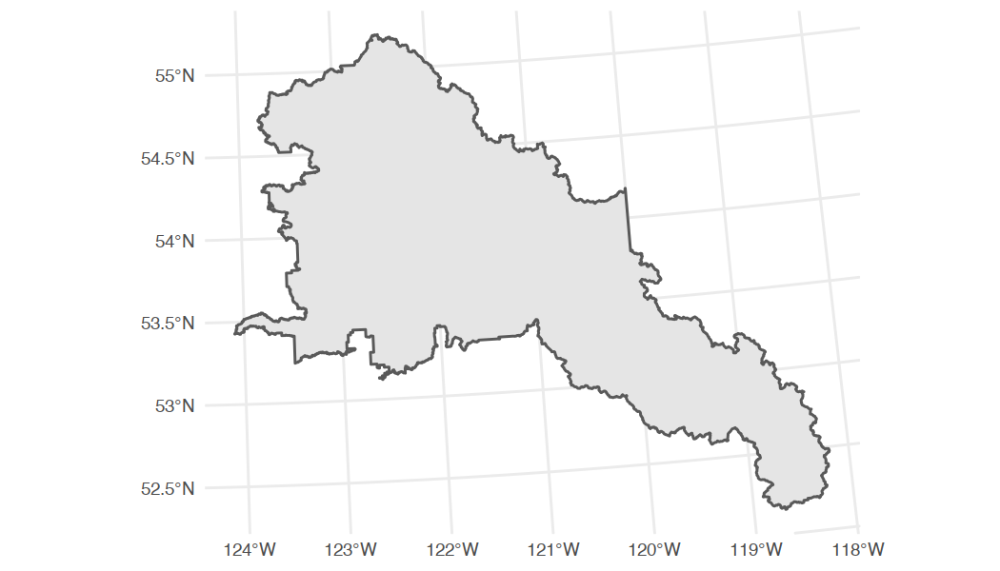
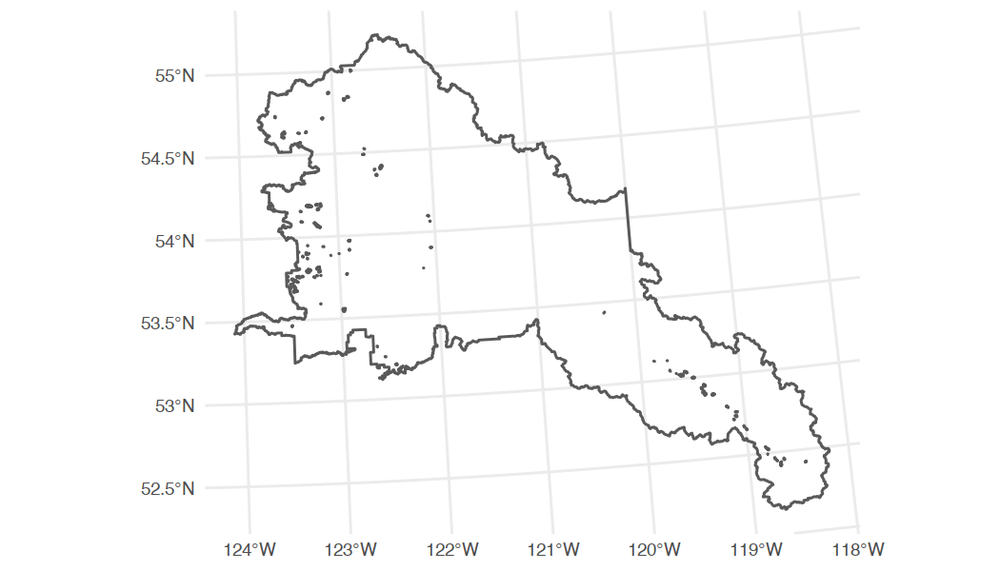
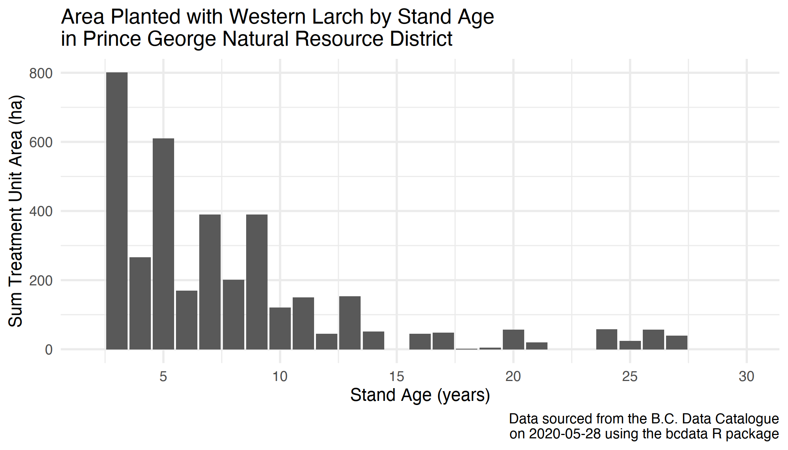
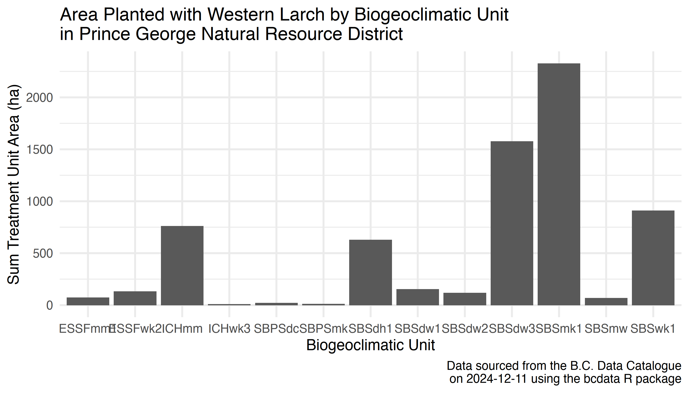

<!--
Copyright 2019 Province of British Columbia

Licensed under the Apache License, Version 2.0 (the "License");
you may not use this file except in compliance with the License.
You may obtain a copy of the License at

http://www.apache.org/licenses/LICENSE-2.0

Unless required by applicable law or agreed to in writing, software distributed under the License is distributed on an "AS IS" BASIS,
WITHOUT WARRANTIES OR CONDITIONS OF ANY KIND, either express or implied.
See the License for the specific language governing permissions and limitations under the License.
-->


This vignette will demonstrate how you can use `bcdata` to access and explore British Columbia silviculture data.


## Silviculture Data

Silviculture data for British Columbia are largely collected and stored through the [Reporting Silviculture Updates and Land Status Tracking System (RESULTS) database](https://www2.gov.bc.ca/gov/content?id=F62992DA5B324446AD5E1B5BFFA404CC)---including information on the management of openings, disturbances, silviculture activities and obligation declarations as required by the [Forest and Range Practices Act](https://www2.gov.bc.ca/gov/content?id=D65006C0326B4E0F838194044C10CA86). [RESULTS data sets are publicly available through the B.C. Data Catalogue](https://catalogue.data.gov.bc.ca/dataset?q=RESULTS+silviculture) under the [Open Government Licence - British Columbia](https://www2.gov.bc.ca/gov/content?id=A519A56BC2BF44E4A008B33FCF527F61).


## Reforestation with Climate Considerations

[Western larch](https://en.wikipedia.org/wiki/Larix_occidentalis) has been identified as a tree species that will be well-adapted to projected future climates in northern British Columbia.  In 2013, forest policy was developed that allowed foresters to plant western larch outside of its natural range as a climate change adaptation silviculture measure.

#### How much western larch has been planted in the Prince George Natural Resource District?

Let's use the `bcdata` package to search, retrieve and explore the RESULTS silviculture data and answer this question.


## Getting Started

To start, let's load the `bcdata` package. We will also load the `dplyr` and `ggplot2` packages to help us work with the data. You can learn more about the `dplyr` package [here](https://dplyr.tidyverse.org/) and the `ggplot2` package [here](https://ggplot2.tidyverse.org/):


``` r
library(bcdata)
library(dplyr)
library(ggplot2)
```


## Getting the Data

We can gather the data we need to answer our question using the [RESULTS - silviculture forest cover dataset](https://catalogue.data.gov.bc.ca/dataset/258bb088-4113-47b1-b568-ce20bd64e3e3). First, let's take a look at the metadata record using `bcdc_get_record()`:


``` r
# Get the metadata using the human-readable record name
bcdc_get_record("results-forest-cover-silviculture")
#> B.C. Data Catalogue Record: RESULTS - Forest Cover Silviculture
#> Name: results-forest-cover-silviculture (ID: 258bb088-4113-47b1-b568-ce20bd64e3e3)
#> Permalink: https://catalogue.data.gov.bc.ca/dataset/258bb088-4113-47b1-b568-ce20bd64e3e3
#> Licence: Open Government Licence - British Columbia
#> Description: RESULTS opening's forest cover poylgons with silviculture component
#>  provided.  Current forest cover subimssion into RESULTS must contain attribute and map
#>  information.  However, there are historical forest cover polygon infomration where maps
#>  are not available.  Forest Cover is provided at three critical milestones of at
#>  harvesting, at regeneration, and at free growing.  This is a part o fthe Silviculture
#>  and Land Status Tracking dataset, which includes tracking achievement of silviculture
#>  obligations on Crown Land
#> Available Resources (1):
#>  1. WMS getCapabilities request (wms)
#> Access the full 'Resources' data frame using:
#>  bcdc_tidy_resources('258bb088-4113-47b1-b568-ce20bd64e3e3')
#> Query and filter this data using:
#>  bcdc_query_geodata('258bb088-4113-47b1-b568-ce20bd64e3e3')
```

We see that this is a [Web Feature Service-enabled](https://en.wikipedia.org/wiki/Web_Feature_Service) geospatial data set--the list of data resources includes `WMS getCapabilities request`--so we can query and retrieve this geospatial data set using `bcdc_query_geodata()`:


``` r
# Query the data using the permanent ID of the record to guard against name changes
bcdc_query_geodata("258bb088-4113-47b1-b568-ce20bd64e3e3")
#> Querying 'results-forest-cover-silviculture' record
#> • Using collect() on this object will return 957189 features and 159 fields
#> • Accessing this record requires pagination and will make 96 separate requests to the WFS.
#> • See ?bcdc_options
#> • At most six rows of the record are printed here
#> ────────────────────────────────────────────────────────────────────────────────────────────────────
#> Simple feature collection with 6 features and 159 fields
#> Geometry type: MULTIPOLYGON
#> Dimension:     XY
#> Bounding box:  xmin: 1184167 ymin: 526455.5 xmax: 1801754 ymax: 1083545
#> Projected CRS: NAD83 / BC Albers
#> # A tibble: 6 × 160
#>   id         FOREST_COVER_ID STOCKING_STANDARD_UN…¹ OPENING_ID STANDARDS_UNIT_ID SILV_POLYGON_NUMBER
#>   <chr>                <int>                  <int>      <int> <chr>             <chr>              
#> 1 WHSE_FORE…         4177991                2243439    1724262 1                 C                  
#> 2 WHSE_FORE…         3994007                     NA    1248495 <NA>              91                 
#> 3 WHSE_FORE…         3994067                     NA    1120935 <NA>              86                 
#> 4 WHSE_FORE…         3994009                1404558    1248495 A                 AA                 
#> 5 WHSE_FORE…         3994057                1211894    1120935 B                 2B                 
#> 6 WHSE_FORE…         3994063                     NA    1120935 <NA>              82                 
#> # ℹ abbreviated name: ¹​STOCKING_STANDARD_UNIT_ID
#> # ℹ 154 more variables: SILV_POLYGON_AREA <dbl>, SILV_POLYGON_NET_AREA <dbl>,
#> #   SILV_NON_MAPPED_AREA <int>, STOCKING_STATUS_CODE <chr>, STOCKING_TYPE_CODE <chr>,
#> #   STOCKING_CLASS_CODE <chr>, SILV_RESERVE_CODE <chr>, SILV_RESERVE_OBJECTIVE_CODE <chr>,
#> #   TREE_COVER_PATTERN_CODE <chr>, REENTRY_YEAR <chr>, REFERENCE_YEAR <int>, SITE_INDEX <int>,
#> #   SITE_INDEX_SOURCE_CODE <chr>, BGC_ZONE_CODE <chr>, BGC_SUBZONE_CODE <chr>, BGC_VARIANT <chr>,
#> #   BGC_PHASE <chr>, BEC_SITE_SERIES <chr>, BEC_SITE_TYPE <chr>, BEC_SERAL <chr>, …
```

This query shows that this data set has many features and over 150 fields.  Each feature is a treatment unit within a harvested opening, and contains information on the leading five tree species that are present in each treatment unit, including stems per hectare, age, and height.

Note that we have only _queried_ the data set so far---the data set would be too large (~1GB) to download efficiently.  So, let's use `filter()` with `bcdc_query_geodata()` to refine our query _before_ we collect the data and import it into R.


## Refining a Geospatial Data Query

To address our question, we need the treatment data (1) from the Prince George Natural Resource District _and_ (2) that contain western larch.

First, we can use the `bcdata` package to download the spatial boundary for the Prince George Natural Resource District&mdash;`DPG` is the `ORG_UNIT` for Prince George Natural Resource District:


``` r
## Create a spatial feature object named dpg
dpg <- bcdc_query_geodata("natural-resource-nr-district") %>%
  filter(ORG_UNIT=="DPG") %>% # filter for Prince George Natural Resource District
  collect() # and collect the data
```

Let's plot this spatial object and double check we have we what we need:


``` r
dpg %>%
  ggplot() +
  geom_sf() +
  theme_minimal()
```

<div class="figure">

<p class="caption">plot of chunk plot-dpg</p>
</div>

Now we have a spatial object that we can use as a bounding box to filter and download records in the RESULTS - silviculture layer from the Prince George Natural Resource District.

We only need to download the treatments that have western larch planted. We can use the `bcdc_describe_feature()` helper function to examine the column names and types of the layer. In this case, we want to keep rows where the five `S_SPECIES_CODE_*` columns contain `"LW"`, the code for western larch.


``` r
# Make a vector of tree species we are interested in
# (in this case only LW for western larch)
spp_list = c("LW")

# Query and filter the data layer
trees_dpg <-
  bcdc_query_geodata("258bb088-4113-47b1-b568-ce20bd64e3e3") %>%
  filter(INTERSECTS(dpg)) %>% #filter for records that are within the DPG boundary
  filter(
      S_SPECIES_CODE_1 %in% spp_list |  #filter for LW records
      S_SPECIES_CODE_2 %in% spp_list |
      S_SPECIES_CODE_3 %in% spp_list |
      S_SPECIES_CODE_4 %in% spp_list |
      S_SPECIES_CODE_5 %in% spp_list
  ) %>%
  collect() #collect/download the data
```


## Exploring the Data

Let's look at the dimensions of this now much more manageable data object we have downloaded from the B.C. Data Catalogue:


``` r
dim(trees_dpg)
#> [1] 261 160
```

We can see there are several treatment units planted with western larch, and we can make a quick map of these harvested openings for the Prince George Natural Resource District:


``` r
trees_dpg %>%
  ggplot() +
  geom_sf() +
  geom_sf(data = dpg, fill = NA) + #add the DPG spatial boundary
  theme_minimal()
```

<div class="figure">

<p class="caption">plot of chunk map-larch-plantations-dpg</p>
</div>


We can also create some quick descriptive summaries of the data, treating the geospatial attribute table as a data frame in R, and answer our original question---how much western larch has been planted in the Prince George Natural Resource District?


#### What is the size and age distribution of larch plantations in the Prince George Natural Resource District in the year 2020?


``` r
trees_dpg %>%
  mutate(age = 2020 - REFERENCE_YEAR + S_SPECIES_AGE_1) %>% #create a plantation age column
  ggplot() +  #start a plot
  aes(x = age, y = FEATURE_AREA_SQM/10000) + #convert feature area to hectares
  geom_bar(stat = "sum") +
  scale_x_continuous(name = "Stand Age (years)",
                     limits = c(2, 30),
                     breaks = seq(from = 5, to = 30, by = 5)) +
  labs(y = "Sum Treatment Unit Area (ha)",
       title = "Area Planted with Western Larch by Stand Age\nin Prince George Natural Resource District",
       caption = paste0("Data sourced from the B.C. Data Catalogue\n on ",
                        Sys.Date(),
                        " using the bcdata R package")) +
  theme_minimal() +
  theme(legend.position = "none")
```

<div class="figure">

<p class="caption">plot of chunk unnamed-chunk-1</p>
</div>

#### What is the Biogeoclimatic Ecosystem Classification (BEC) distribution of western larch plantations in the Prince George Natural Resource District?

We can download [British Columbia biogeoclimatic (BEC) data](https://catalogue.data.gov.bc.ca/dataset/bec-map) from the B.C. Data Catalogue using `bcdata` and join to our existing `trees_dpg` geospatial dataset using the `st_join` function from the `sf` package. You can learn more about `sf` [here](https://r-spatial.github.io/sf/).


``` r
library(sf) #load the sf package

# Load the BEC data for Prince George Natural Resource District
# Load the BEC data for Prince George Natural Resource District
bgc_dpg <- bcdc_query_geodata("WHSE_FOREST_VEGETATION.BEC_BIOGEOCLIMATIC_POLY") %>%
  filter(BBOX(dpg, crs = "EPSG:3005")) %>% #note filtering with a BoundingBox
  collect()

# Join the BEC data with our tress_dpg geospatial data set
trees_bec_dpg <- trees_dpg %>%
  st_join(bgc_dpg[, "MAP_LABEL"]) #join BEC data for each polygon
```

Now, we can summarize the area planted with western larch by biogeoclimatic unit:


``` r
trees_bec_dpg %>%
  group_by(MAP_LABEL) %>% # group polygons by biogeoclimatic unit
  summarise(Area = sum(FEATURE_AREA_SQM)/10000) %>%
  ggplot() +
  aes(x = MAP_LABEL, y = Area) +
  geom_col() +
  labs(y = "Sum Treatment Unit Area (ha)",
       x = "Biogeoclimatic Unit",
       title = "Area Planted with Western Larch by Biogeoclimatic Unit\nin Prince George Natural Resource District",
       caption = paste0("Data sourced from the B.C. Data Catalogue\n on ",
                        Sys.Date(),
                        " using the bcdata R package")) +
  theme_minimal() +
  theme(legend.position = "none")
```

<div class="figure">

<p class="caption">plot of chunk unnamed-chunk-3</p>
</div>
